# Claude Code Config


<sub>Fresh context. Injected guidance. Structured coordination. No memory of previous sessions.<br/>The parallels are entirely coincidental.</sub>

---

Event-driven policy, process, and governance for Claude Code. Ways encode *how we do things* — prescriptive rules triggered by context, not requested by intent — and inject them just-in-time before tools execute.

```mermaid
sequenceDiagram
    participant U as 👤 You
    participant C as 🤖 Claude
    participant W as ⚡ Ways

    rect rgba(21, 101, 192, 0.2)
        U->>C: "fix the auth bug"
        W-->>C: 🔑 Security · 🐛 Debugging
    end
    rect rgba(106, 27, 154, 0.2)
        C->>W: about to run: git commit
        W-->>C: 📝 Commit format rules
    end
    rect rgba(0, 105, 92, 0.2)
        C->>W: spawning subagent
        W-->>C: 🔑 Security (injected into subagent too)
    end
    rect rgba(198, 40, 40, 0.15)
        Note over U,W: Context fills up → auto-compact → ways reset → cycle repeats
    end
```



**Ways** = policy and process encoded as contextual guidance. Triggered by keywords, commands, and file patterns — they fire once per session, before tools execute, and carry into subagents.

This repo ships with software development ways, but the mechanism is general-purpose. You could have ways for:
- Excel/Office productivity
- AWS operations
- Financial analysis
- Research workflows
- Anything with patterns Claude should know about

## Prerequisites

Runs on **Linux** and **macOS**. The hooks are all bash and lean on standard POSIX utilities plus a few extras:

| Tool | Purpose | Notes |
|------|---------|-------|
| [Claude Code](https://docs.anthropic.com/en/docs/claude-code) | The agent this configures | `npm install -g @anthropic-ai/claude-code` |
| `git` | Version control, update checking | Usually pre-installed |
| `jq` | JSON parsing (hook inputs, configs, API responses) | **Must install** |
| `gzip` | Compression-based semantic matching (NCD) | Usually pre-installed |
| `bc` | Math for NCD similarity scoring | Usually pre-installed (not in Arch `base`) |
| `python3` | Governance traceability tooling | Stdlib only — no pip packages |
| [`gh`](https://cli.github.com/) | GitHub API (update checks, repo macros) | Recommended, not required — degrades gracefully |

Standard utilities (`bash`, `awk`, `sed`, `grep`, `find`, `timeout`, `tr`, `sort`, `wc`, `date`) are assumed present via coreutils.

**Platform install guides:**
[macOS (Homebrew)](docs/prerequisites-macos.md) · [Arch Linux](docs/prerequisites-arch.md) · [Debian / Ubuntu](docs/prerequisites-debian.md) · [Fedora / RHEL](docs/prerequisites-fedora.md)

> **macOS note:** `timeout` is a GNU coreutils command not present by default. Install `coreutils` via Homebrew — see the [macOS guide](docs/prerequisites-macos.md) for PATH setup.

## Quick Start

**Fork first.** This repo is a starting point — you'll want to add your own ways for your own workflows. Fork it, then clone your fork:

```bash
# Backup existing config if any
[ -d ~/.claude ] && mv ~/.claude ~/.claude-backup-$(date +%Y%m%d)

# Clone your fork
git clone https://github.com/YOUR-USERNAME/claude-code-config ~/.claude

# Make hooks executable
chmod +x ~/.claude/hooks/**/*.sh ~/.claude/hooks/*.sh 2>/dev/null

# Restart Claude Code - ways are now active
```

The built-in ways cover software development, but the framework doesn't care about the domain. Replace them, extend them, add entirely new ones. Your fork stays synced with upstream improvements while keeping your custom ways separate.

> **Just want to try it?** You can clone directly (`git clone https://github.com/aaronsb/claude-code-config ~/.claude`) — the system will nudge you if you fall behind upstream.

## How It Works

`core.md` loads at session start with:
- **Behavioral guidance**: Collaboration style, communication norms, uncertainty handling
- **Operational rules**: File operation constraints, attribution settings
- **Ways index**: Dynamic table of all available ways (generated by macro)

Then, as you work:

1. **UserPromptSubmit** scans your message for pattern matches
2. **PreToolUse** intercepts commands and file edits *before they execute* - Claude gets guidance while it can still act on it
3. **SubagentStart** injects relevant ways into subagents spawned via Task
4. Matching ways inject via `additionalContext` - Claude sees them
5. Each way loads **once per session** - marker files prevent re-triggering

### Once-Per-Session Gating

Ways don't continuously re-hook. When a way triggers:

```
First match  → Output guidance + create marker file
Second match → Marker exists → No-op (silent)
```

Markers live in `/tmp/.claude-way-{domain}-{wayname}-{session_id}`. This prevents noise - you see each way once, when first relevant, then it stays quiet.

See [docs/architecture.md](docs/architecture.md) for detailed Mermaid diagrams of the trigger flow and state machine.

```
~/.claude/hooks/ways/
├── core.md                      # Loads at startup (static guidance)
├── macro.sh                     # Generates dynamic ways table
├── show-core.sh                 # Combines macro + core.md
├── check-prompt.sh              # Keyword + semantic matching
├── check-bash-pre.sh            # Command matching (PreToolUse:Bash)
├── check-file-pre.sh            # File path matching (PreToolUse:Edit|Write)
├── show-way.sh                  # Once-per-session gating
├── semantic-match.sh            # Gzip NCD similarity scoring
└── {domain}/                    # Domain directories
    └── {wayname}/
        ├── way.md               # Frontmatter + guidance
        └── macro.sh             # Optional dynamic context
```

## Configuration

Ways config lives in `~/.claude/ways.json`:

```json
{
  "disabled": ["itops"]
}
```

| Field | Purpose |
|-------|---------|
| `disabled` | Array of domain names to skip (e.g., `["itops", "softwaredev"]`) |

Disabled domains are completely ignored - no pattern matching, no output.

## Creating a Way

Each way is self-contained with YAML frontmatter:

```markdown
---
match: regex
pattern: pattern1|pattern2|regex.*
files: \.tsx$|components/.*
commands: npm\ run\ build
macro: prepend
---
# Way Name

## Guidance
- Compact, actionable points
```

Create a directory in `~/.claude/hooks/ways/{domain}/{wayname}/` and add `way.md`. For project-local: `$PROJECT/.claude/ways/{domain}/{wayname}/way.md`.

### Frontmatter Fields

| Field | Purpose |
|-------|---------|
| `match:` | `regex` (default) or `semantic` |
| `pattern:` | Regex matched against user prompts |
| `files:` | Regex matched against file paths (Edit/Write) |
| `commands:` | Regex matched against bash commands |
| `macro:` | `prepend` or `append` - run `macro.sh` for dynamic context |
| `description:` | Reference text for NCD similarity (semantic mode) |
| `vocabulary:` | Domain words for keyword counting (semantic mode) |
| `threshold:` | NCD similarity threshold (default 0.58, lower = stricter) |

## Semantic Matching

For ambiguous triggers like "design" (software design vs UI design), ways can use **semantic matching** instead of regex:

```yaml
---
match: semantic
description: software system design architecture patterns database schema
vocabulary: design architecture pattern schema api component factory
threshold: 0.55  # Optional: stricter matching (default 0.58)
---
```

Semantic matching combines two techniques:
1. **Keyword counting** - how many domain-specific words appear in the prompt
2. **Gzip NCD** - compression-based similarity (Normalized Compression Distance)

```
Match if: domain_keywords >= 2 OR ncd_similarity < 0.58
```

This correctly distinguishes:
- ✓ "design the database schema" → triggers (software design)
- ✗ "button design looks off" → no trigger (UI design)

**Zero dependencies** - uses only `bash`, `gzip`, `bc`, `grep` (universal on all distros).

## Way Macros

Static guidance can't know your environment. Macros add dynamic state detection:

```
Way    = guidance (the "how")
Macro  = state detection (the "what is")
Output = contextual guidance (the "how, given what is")
```

**Example**: `github.macro.sh` detects solo vs team project:
```bash
#!/bin/bash
gh repo view &>/dev/null || { echo "**Note**: Not a GitHub repo"; exit 0; }
CONTRIBUTORS=$(timeout 2 gh api repos/:owner/:repo/contributors --jq 'length' 2>/dev/null)
if [[ "$CONTRIBUTORS" -le 2 ]]; then
  echo "**Context**: Solo project - PR optional"
else
  echo "**Context**: Team project - PR recommended"
fi
```

Macros are optional. Ways without macros work as pure static guidance.

See [ADR-004](docs/adr/ADR-004-way-macros.md) for full macro documentation.

## Project-Local Ways

Projects can have custom ways in `.claude/ways/{domain}/{wayname}/`:

**Security Note**: Project-local **macros are disabled by default**. Static way content (way.md) always loads, but macro.sh scripts only run for trusted projects. To trust a project:

```bash
echo "/path/to/your/project" >> ~/.claude/trusted-project-macros
```

This prevents malicious repositories from executing code via way macros.

```
your-project/.claude/ways/
└── myproject/
    ├── api/
    │   └── way.md       # Project API conventions
    ├── deployment/
    │   ├── way.md       # How we deploy
    │   └── macro.sh     # Query deployment status
    └── testing/
        └── way.md       # Override global testing way
```

Project ways override global ways with the same path. A template is auto-created on first session.

## Built-in Ways (Software Dev)

This repo ships with 20 development-focused ways:

| Way | Triggers On |
|-----|-------------|
| **adr** | `docs/adr/*.md`, "architect", "decision" |
| **api** | "endpoint", "rest", "graphql" |
| **commits** | `git commit`, "push to remote" |
| **config** | `.env`, "environment variable" |
| **debugging** | "bug", "broken", "investigate" |
| **deps** | `npm install`, "dependency", "package" |
| **docs** | `README.md`, "documentation" |
| **errors** | "error handling", "exception" |
| **github** | `gh`, "pull request", "issue" |
| **knowledge** | `.claude/ways/*.md`, "ways" |
| **migrations** | "migration", "schema" |
| **patches** | `*.patch`, "git apply" |
| **performance** | "slow", "optimize", "profile" |
| **quality** | "refactor", "code review", "solid" |
| **release** | "deploy", "version", "changelog" |
| **security** | "auth", "secret", "token" |
| **ssh** | `ssh`, `scp`, "remote server" |
| **subagents** | "delegate", "subagent" |
| **testing** | `pytest`, `jest`, "coverage", "tdd" |
| **tracking** | `.claude/todo-*.md`, "multi-session" |

**Replace these entirely** if your domain isn't software dev. The framework doesn't care.

## Also Included

- **Agent team coordination** — three-scope model (agent/teammate/subagent) with scope-gated governance and team telemetry. See [teams](docs/hooks-and-ways/teams.md).
- **Usage stats** — way firing telemetry by scope, team, project, and trigger type. See [stats](docs/hooks-and-ways/stats.md).
- **6 specialized subagents** for complex tasks (requirements, architecture, planning, review, workflow, organization)
- **ADR-driven workflow** guidance
- **GitHub-first patterns** (auto-detects `gh` availability)
- **Update checking** — detects direct clones, forks, and plugin installs; nudges you when behind upstream
- **Governance traceability** — optional `provenance:` metadata on ways traces guidance back to policy documents and regulatory controls (NIST, OWASP, ISO, SOC 2) with per-control justification evidence. Includes a governance operator (`governance.sh`) for coverage reports, control queries, traceability matrices, and integrity linting. See [provenance](docs/hooks-and-ways/provenance.md).
- **Governance citation skill** — Claude can semantically discover and cite governance controls when justifying recommendations, grounding advice in actual standards rather than general knowledge

## Ways vs Skills

Claude Code has built-in **Skills** (semantically-discovered knowledge bundles). How do ways compare?

| Aspect | Skills | Ways |
|--------|--------|------|
| **Discovery** | Semantic (Claude decides based on intent) | Pattern (regex on prompts/tools/files) |
| **Trigger** | User asks something matching skill description | Hook events (tool use, file edit, keywords) |
| **Invocation** | Claude requests permission to use | Automatic injection (no permission needed) |
| **Frequency** | Per semantic match | Once per session (marker-gated) |
| **Dynamic context** | Via bundled scripts | Via macro.sh |
| **Tool restriction** | `allowed-tools` field | Not supported |

**They complement each other:**

- **Ways** = *"how we do things"* — policy, process, governance. Prescriptive rules triggered by events and context. Encodes developed opinions about process.
- **Skills** = *"what we can do"* — capability, ability. Procedural knowledge triggered by intent and task. Encodes how to accomplish something.

**Use Skills for:**
- Semantic discovery ("explain this code" → explaining-code skill)
- Tool restrictions (read-only security review)
- Multi-file reference docs with progressive disclosure

**Use Ways for:**
- Tool-triggered guidance (`git commit` → commit format reminder)
- File-triggered guidance (editing `.env` → config best practices)
- Session-gated delivery (show once, not repeatedly)
- Dynamic context (query GitHub API for contributor count)

Skills can't detect tool execution. Ways now support semantic matching via gzip NCD (see above). Together they cover both intent-based and event-based guidance.

**The governance-cite skill** is a concrete example of this complement: ways push governance *in* (automatic injection when triggers match), while the skill lets Claude pull governance *out* (active citation of controls and justifications when explaining why a practice matters). The same provenance data serves both directions.

## Governance

Everything above is about what happens on the floor — the agents, the teams, the guidance, the triggers. But someone has to decide what the handbooks say.

Ways don't emerge from nothing. They're compiled from policy — organizational opinions about how work should be done, informed by regulatory requirements, industry standards, and hard-won experience. The question enterprises will ask is: *"Can you prove your agent governance traces back to actual policy?"*

The answer is yes, and it doesn't require expensive software.

Every way can carry optional `provenance:` metadata linking it to policy documents, regulatory controls, and per-control justification evidence. The runtime ignores it completely — zero tokens, zero latency. But the governance operator can scan all your ways and produce traceability in whatever shape the auditor needs.

```
NIST SP 800-53 CM-3        →  code-lifecycle.md  →  softwaredev/commits/way.md
  ✓ Conventional commit types classify changes by nature
  ✓ Atomic commits make each change independently reviewable

OWASP Top 10 A03:Injection →  operations.md      →  softwaredev/security/way.md
  ✓ Detection table maps SQL concatenation to remediation actions
  ✓ Parameterized queries required as default
```

The built-in ways carry 33 justifications across 13 controls from NIST, OWASP, ISO, SOC 2, CIS, and IEEE. Not decorative — an auditor can follow the chain from regulatory control through policy document to specific guidance, with evidence for each claim. The governance operator reports this as coverage reports, control queries, flat traceability matrices, or JSON — and validates its own structural integrity with `--lint`.

The [`governance/`](governance/) directory contains the tooling and is designed to be separable — tear it out, point it at your own ways and policies, verify the chain. See [ADR-005](docs/adr/ADR-005-governance-traceability.md) for the design rationale.

## Philosophy

Policy-as-code for AI agents — lightweight, portable, deterministic.

| Feature | Why It Matters |
|---------|----------------|
| **Pattern matching** | Predictable, debuggable (no semantic black box) |
| **Shell macros** | Dynamic context from any source (APIs, files, system state) |
| **Zero dependencies** | Bash + jq - runs anywhere |
| **Domain-agnostic** | Swap software dev ways for finance, ops, research, anything |
| **Fully hackable** | Plain text files, fork and customize in minutes |

The string matching is intentionally simple - it keeps the system portable and transparent. The power comes from macros that can query anything and inject real-time context.

## Updating

```bash
cd ~/.claude && git pull
```

## License

MIT
