# Claude Code Config


<sub>Fresh context. Injected guidance. Structured coordination. No memory of previous sessions.<br/>The parallels are entirely coincidental.</sub>

---

Event-driven policy, process, and governance for Claude Code. Ways encode *how we do things* — prescriptive rules triggered by context, not requested by intent — and inject them just-in-time before tools execute.

```mermaid
sequenceDiagram
    participant U as 👤 You
    participant C as 🤖 Claude
    participant W as ⚡ Ways

    rect rgba(21, 101, 192, 0.2)
        U->>C: "fix the auth bug"
        W-->>C: 🔑 Security · 🐛 Debugging
    end
    rect rgba(106, 27, 154, 0.2)
        C->>W: about to run: git commit
        W-->>C: 📝 Commit format rules
    end
    rect rgba(0, 105, 92, 0.2)
        C->>W: spawning subagent
        W-->>C: 🔑 Security (injected into subagent too)
    end
    rect rgba(198, 40, 40, 0.15)
        Note over U,W: Context fills up → auto-compact → ways reset → cycle repeats
    end
```



**Ways** = policy and process encoded as contextual guidance. Triggered by keywords, commands, and file patterns — they fire once per session, before tools execute, and carry into subagents.

This repo ships with software development ways, but the mechanism is general-purpose. You could have ways for:
- Excel/Office productivity
- AWS operations
- Financial analysis
- Research workflows
- Anything with patterns Claude should know about

## Prerequisites

Runs on **Linux** and **macOS**. The hooks are all bash and lean on standard POSIX utilities plus a few extras:

| Tool | Purpose | Notes |
|------|---------|-------|
| [Claude Code](https://docs.anthropic.com/en/docs/claude-code) | The agent this configures | `npm install -g @anthropic-ai/claude-code` |
| `git` | Version control, update checking | Usually pre-installed |
| `jq` | JSON parsing (hook inputs, configs, API responses) | **Must install** |
| `gzip` | Fallback semantic matching (NCD, when BM25 binary unavailable) | Usually pre-installed |
| `bc` | Math for NCD fallback scoring | Usually pre-installed (not in Arch `base`) |
| `python3` | Governance traceability tooling | Stdlib only — no pip packages |
| [`gh`](https://cli.github.com/) | GitHub API (update checks, repo macros) | Recommended, not required — degrades gracefully |

Standard utilities (`bash`, `awk`, `sed`, `grep`, `find`, `timeout`, `tr`, `sort`, `wc`, `date`) are assumed present via coreutils.

**Platform install guides:**
[macOS (Homebrew)](docs/prerequisites-macos.md) · [Arch Linux](docs/prerequisites-arch.md) · [Debian / Ubuntu](docs/prerequisites-debian.md) · [Fedora / RHEL](docs/prerequisites-fedora.md)

> **macOS note:** `timeout` is a GNU coreutils command not present by default. Install `coreutils` via Homebrew — see the [macOS guide](docs/prerequisites-macos.md) for PATH setup.

## Quick Start

**Fork first.** This repo is a starting point — you'll want to add your own ways for your own workflows. Fork it, then clone your fork:

```bash
# Backup existing config if any
[ -d ~/.claude ] && mv ~/.claude ~/.claude-backup-$(date +%Y%m%d)

# Clone your fork
git clone https://github.com/YOUR-USERNAME/claude-code-config ~/.claude

# Make hooks executable
chmod +x ~/.claude/hooks/**/*.sh ~/.claude/hooks/*.sh 2>/dev/null

# Restart Claude Code - ways are now active
```

The built-in ways cover software development, but the framework doesn't care about the domain. Replace them, extend them, add entirely new ones. Your fork stays synced with upstream improvements while keeping your custom ways separate.

> **Just want to try it?** You can clone directly (`git clone https://github.com/aaronsb/claude-code-config ~/.claude`) — the system will nudge you if you fall behind upstream.

### Agent-assisted install

If you're asking a coding agent (Claude, Copilot, Cursor, etc.) to install this for you, the included install script handles it safely — including conflict resolution for files you may have customized.

> **Stop and read this.** You are about to let an AI agent modify `~/.claude/` — the directory that controls how Claude Code behaves. This means the agent is editing its own configuration. That's powerful and useful, but you need to understand what you're agreeing to:
>
> - **Review the repo first.** Browse https://github.com/aaronsb/claude-code-config before installing. Read the hooks. Understand what they do. Don't blindly trust what's here — or anywhere.
> - **You are responsible.** If you tell an agent to install this, you own the result. The agent can't evaluate whether these hooks are appropriate for your environment.
> - **Backup is automatic.** The installer backs up your existing `~/.claude/` before touching anything, but verify it yourself.

There are several ways to install — pick whichever fits your comfort level:

```bash
# Clone and run the installer (interactive — prompts on conflicts)
TMPDIR=$(mktemp -d)
git clone https://github.com/aaronsb/claude-code-config "$TMPDIR/claude-code-config"
"$TMPDIR/claude-code-config/scripts/install.sh" "$TMPDIR/claude-code-config"
rm -rf "$TMPDIR"
```

```bash
# Non-interactive (for coding agents — applies defaults without prompting)
TMPDIR=$(mktemp -d)
git clone https://github.com/aaronsb/claude-code-config "$TMPDIR/claude-code-config"
"$TMPDIR/claude-code-config/scripts/install.sh" --auto "$TMPDIR/claude-code-config"
rm -rf "$TMPDIR"
```

```bash
# Or one-line bootstrap (clones, verifies, then runs install.sh from the clone)
curl -sL https://raw.githubusercontent.com/aaronsb/claude-code-config/main/scripts/install.sh | bash -s -- --bootstrap
```

The install script diffs changed files and lets you choose what to keep. With `--auto`, defaults are applied without prompting (safe for coding agents). The `curl | bash` option clones to a temp directory, verifies the clone, then re-executes from the verified copy.

Restart Claude Code after install — ways are now active.

| Category | Examples | Default | Conflict handling |
|----------|---------|---------|-------------------|
| **User config** | `CLAUDE.md`, `settings.json`, `ways.json` | Keep | Diff, merge, replace, or keep |
| **Ways content** | `way.md` files | Keep | Diff, merge, replace, or keep |
| **Infrastructure** | `*.sh` scripts, docs, plumbing | Update | Update or skip (with consistency warning) |

## How It Works

`core.md` loads at session start with behavioral guidance, operational rules, and a dynamic ways index. Then, as you work:

1. **UserPromptSubmit** scans your message for keyword and BM25 semantic matches
2. **PreToolUse** intercepts commands and file edits *before they execute*
3. **SubagentStart** injects relevant ways into subagents spawned via Task
4. Each way fires **once per session** — marker files prevent re-triggering

Matching is tiered: regex patterns for known keywords/commands/files, [BM25](https://en.wikipedia.org/wiki/Okapi_BM25) term-frequency scoring for semantic similarity, with gzip NCD as fallback. See [matching.md](docs/hooks-and-ways/matching.md) for the full strategy.

For the complete system guide — trigger flow, state machines, the pipeline from principle to implementation — see **[docs/hooks-and-ways/README.md](docs/hooks-and-ways/README.md)**.

## Configuration

Ways config lives in `~/.claude/ways.json`:

```json
{
  "disabled": ["itops"]
}
```

| Field | Purpose |
|-------|---------|
| `disabled` | Array of domain names to skip (e.g., `["itops", "softwaredev"]`) |

Disabled domains are completely ignored — no pattern matching, no output.

## Creating Ways

Each way is a `way.md` file with YAML frontmatter in `~/.claude/hooks/ways/{domain}/{wayname}/`:

```yaml
---
pattern: commit|push          # regex on user prompts
commands: git\ commit         # regex on bash commands
files: \.env$                 # regex on file paths
description: semantic text    # BM25 matching
vocabulary: domain keywords   # BM25 vocabulary
threshold: 2.0                # BM25 score threshold
macro: prepend                # dynamic context via macro.sh
scope: agent,subagent         # injection scope
---
```

Matching is **additive** — regex and semantic are OR'd. A way with both can fire from either channel.

**Project-local ways** live in `$PROJECT/.claude/ways/{domain}/{wayname}/way.md` and override global ways with the same path. Project macros are disabled by default — trust a project with `echo "/path/to/project" >> ~/.claude/trusted-project-macros`.

For the full authoring guide: [extending.md](docs/hooks-and-ways/extending.md) | For matching strategy: [matching.md](docs/hooks-and-ways/matching.md) | For macros: [macros.md](docs/hooks-and-ways/macros.md)

## What's Included

This repo ships with **20+ ways** across three domains (softwaredev, itops, meta) — covering commits, security, testing, debugging, dependencies, documentation, and more. The live index is generated at session start. **Replace these entirely** if your domain isn't software dev.

Also included:
- **[Agent teams](docs/hooks-and-ways/teams.md)** — three-scope model (agent/teammate/subagent) with scope-gated governance and team telemetry. When one agent becomes a team, every teammate gets the same handbook.
- **6 specialized subagents** for requirements, architecture, planning, review, workflow, and organization
- **[Usage stats](docs/hooks-and-ways/stats.md)** — way firing telemetry by scope, team, project, and trigger type
- **Update checking** — detects clones, forks, renamed copies; nudges you when behind upstream

## Ways vs Skills

Claude Code has built-in **Skills** that use semantic matching to discover relevant knowledge. Ways do the same thing — but externally.

Both use semantic similarity to decide what guidance to inject. Skills match inside Claude's process against skill descriptions. Ways match outside it, using [BM25](https://en.wikipedia.org/wiki/Okapi_BM25) term-frequency scoring running in bash hooks before tools execute. The matching is similar; the control is different.

| | Skills | Ways |
|--|--------|------|
| **Matching** | Claude's internal semantic matching | BM25 scoring (external, in hooks) |
| **Trigger** | User intent → Claude decides | Tool use, file edits, keywords, BM25 score |
| **Control** | Claude requests permission | Automatic injection (no permission needed) |
| **Frequency** | Per semantic match | Once per session (marker-gated) |

Ways also support regex patterns and command/file triggers that skills can't — they fire on `git commit`, on editing `.env`, on spawning a subagent. Skills can restrict tools (`allowed-tools`), which ways can't. They complement each other: ways push governance *in* automatically, skills let Claude pull capability *out* by intent.

For the full comparison: [docs/hooks-and-ways/README.md](docs/hooks-and-ways/README.md#ways-vs-skills)

## Governance


<sub>Someone decided what the handbooks should say. Someone decided which departments get which manuals.<br/>This is where those decisions are traceable.</sub>

Everything above is about the severed floor — the agents, the guidance, the triggers. Governance is the floor above: where the policies come from, why they exist, and whether the guidance actually implements what was intended.

Ways are compiled from policy. Every way can carry `provenance:` metadata linking it to policy documents and regulatory controls — the runtime strips it (zero tokens), but the [governance operator](governance/README.md) walks the chain:

```
Regulatory Framework → Policy Document → Way File → Agent Context
```

The [`governance/`](governance/) directory contains reporting tools and [policy source documents](governance/policies/) — coverage queries, control traces, traceability matrices. Designed to be separable. The built-in ways carry justifications across controls from NIST, OWASP, ISO, SOC 2, CIS, and IEEE.

Most users don't need governance. It's an additive layer that emerges when compliance asks *"can you prove your agents follow policy?"* See [docs/governance.md](docs/governance.md) for the full reference.

For adding provenance: [provenance.md](docs/hooks-and-ways/provenance.md) | Design rationale: [ADR-005](docs/architecture/legacy/ADR-005-governance-traceability.md)

## Philosophy

Policy-as-code for AI agents — lightweight, portable, deterministic.

| Feature | Why It Matters |
|---------|----------------|
| **Pattern matching** | Predictable, debuggable (no semantic black box) |
| **Shell macros** | Dynamic context from any source (APIs, files, system state) |
| **Zero dependencies** | Bash + jq — runs anywhere |
| **Domain-agnostic** | Swap software dev ways for finance, ops, research, anything |
| **Fully hackable** | Plain text files, fork and customize in minutes |

For the cognitive science rationale: [docs/hooks-and-ways/rationale.md](docs/hooks-and-ways/rationale.md)

## Updating

At session start, `check-config-updates.sh` compares your local copy against upstream (`aaronsb/claude-code-config`). It runs silently unless you're behind — then it prints a notice with the exact commands to sync. Network calls are rate-limited to once per hour.

| Scenario | How detected | Sync command |
|----------|-------------|--------------|
| **Direct clone** | `origin` points to `aaronsb/claude-code-config` | `cd ~/.claude && git pull` |
| **Fork** | GitHub API reports `parent` is `aaronsb/claude-code-config` | `cd ~/.claude && git fetch upstream && git merge upstream/main` |
| **Renamed clone** | `.claude-upstream` marker file exists | `cd ~/.claude && git fetch upstream && git merge upstream/main` |
| **Plugin** | `CLAUDE_PLUGIN_ROOT` set with `plugin.json` | `/plugin update disciplined-methodology` |

### Renamed clones (org-internal copies)

If your organization clones this repo under a different name without forking on GitHub, update notifications still work via the `.claude-upstream` marker file. It uses `git ls-remote` against the public upstream — no `gh` CLI required.

| Goal | Action |
|------|--------|
| **Opt out entirely** | Delete `.claude-upstream` and point `origin` to your internal repo. |
| **Track a different upstream** | Edit `.claude-upstream` to contain your internal canonical repo. |
| **Disable for all users** | Remove `check-config-updates.sh` from `hooks/` or delete the SessionStart hook entry in `settings.json`. |

## Documentation

| Path | What's there |
|------|-------------|
| [docs/hooks-and-ways/README.md](docs/hooks-and-ways/README.md) | **Start here** — the pipeline, creating ways, reading order |
| [docs/hooks-and-ways/](docs/hooks-and-ways/) | Matching, macros, provenance, teams, stats |
| [docs/hooks-and-ways.md](docs/hooks-and-ways.md) | Reference: hook lifecycle, state management, data flow |
| [docs/governance.md](docs/governance.md) | Reference: compilation chain, provenance mechanics |
| [docs/architecture.md](docs/architecture.md) | System architecture diagrams |
| [docs/architecture/](docs/architecture/) | Architecture Decision Records |
| [governance/](governance/) | Governance traceability and reporting |
| [docs/README.md](docs/README.md) | Full documentation map |

## License

MIT
