# Ways System Architecture

Visual documentation of the ways trigger system.

## How a Session Flows

A typical session from the user's perspective, showing how events trigger way injections at each step:

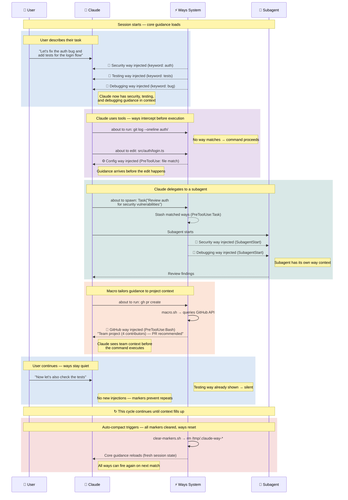

## Hook Flow

How ways get triggered during a Claude Code session:

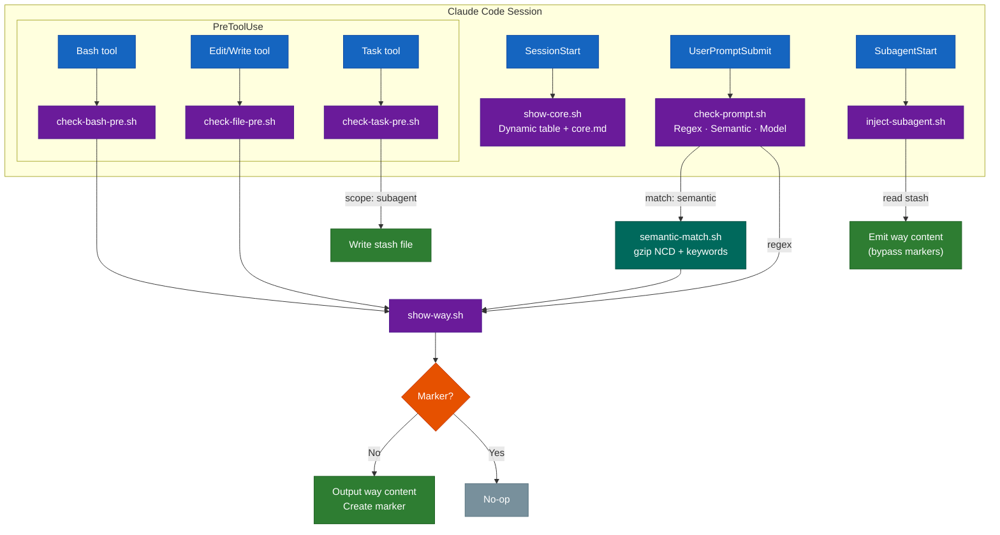

## Subagent Injection

Two-phase stash pattern bridges the gap between Task prompt visibility and SubagentStart injection:

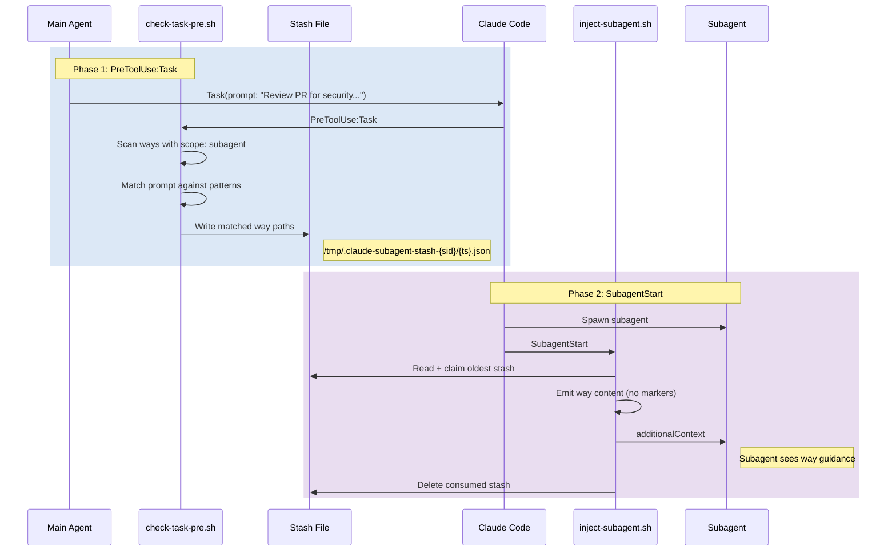

### Scope Filtering

The `scope` field controls where ways inject:

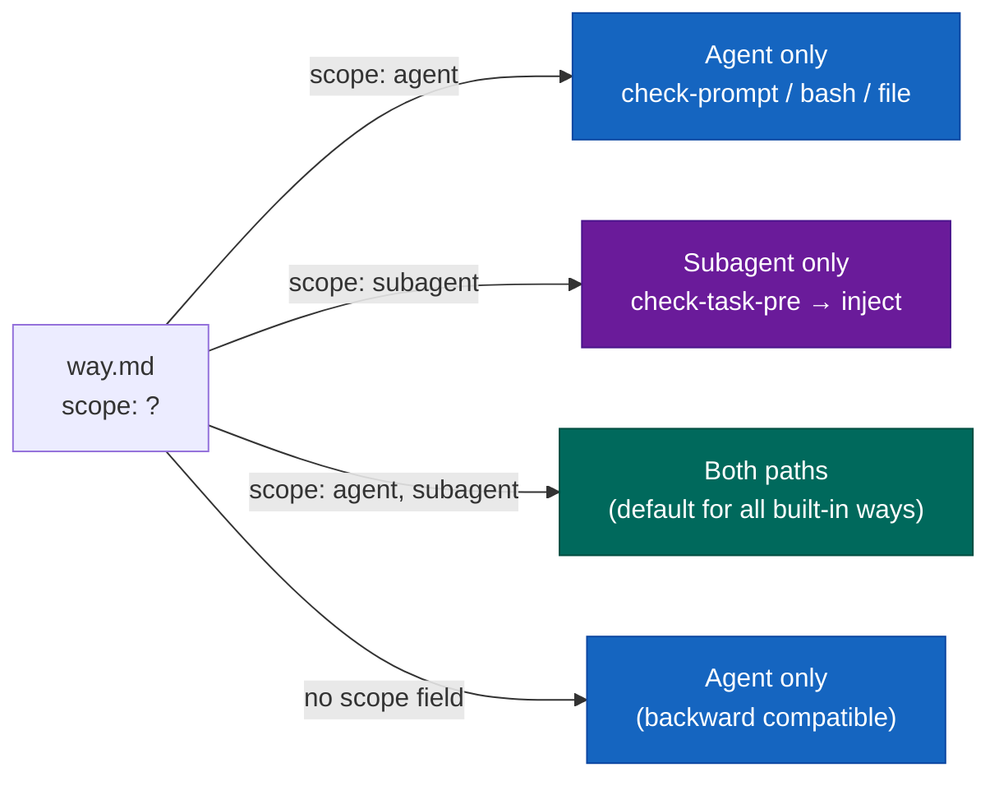

### Parallel Subagent Handling

Multiple Task tools in one message create separate stash files consumed in FIFO order:

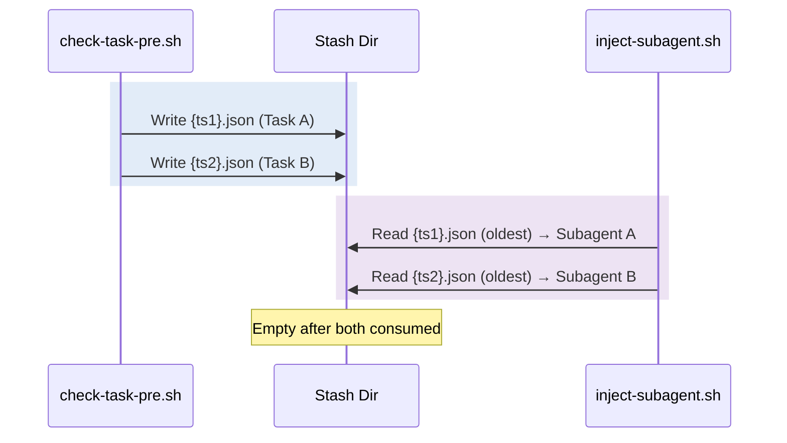

## Way State Machine

Each (way, session) pair has exactly two states:

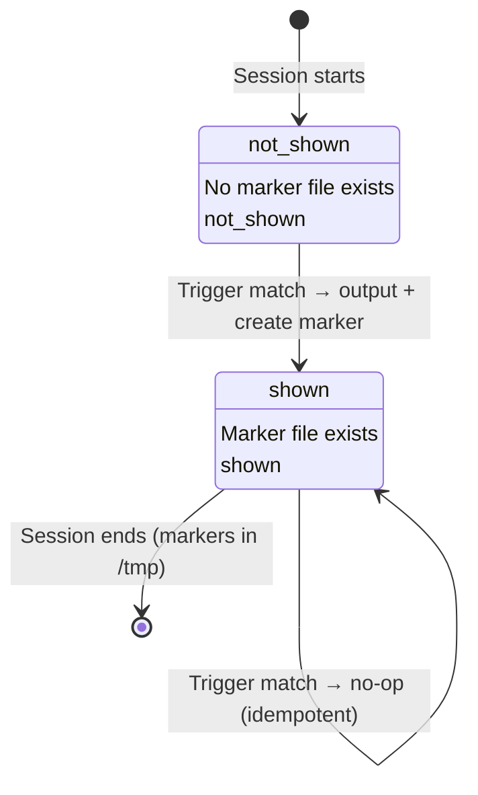

**Exception**: Subagent injection bypasses this state machine entirely. Ways injected via `inject-subagent.sh` are emitted without marker checks.

## Trigger Matching

How prompts and tool use get matched to ways:

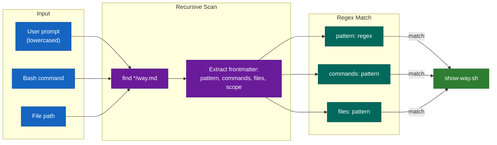

## Semantic Matching

For ways with `match: semantic`, regex is replaced with gzip NCD + keyword counting:

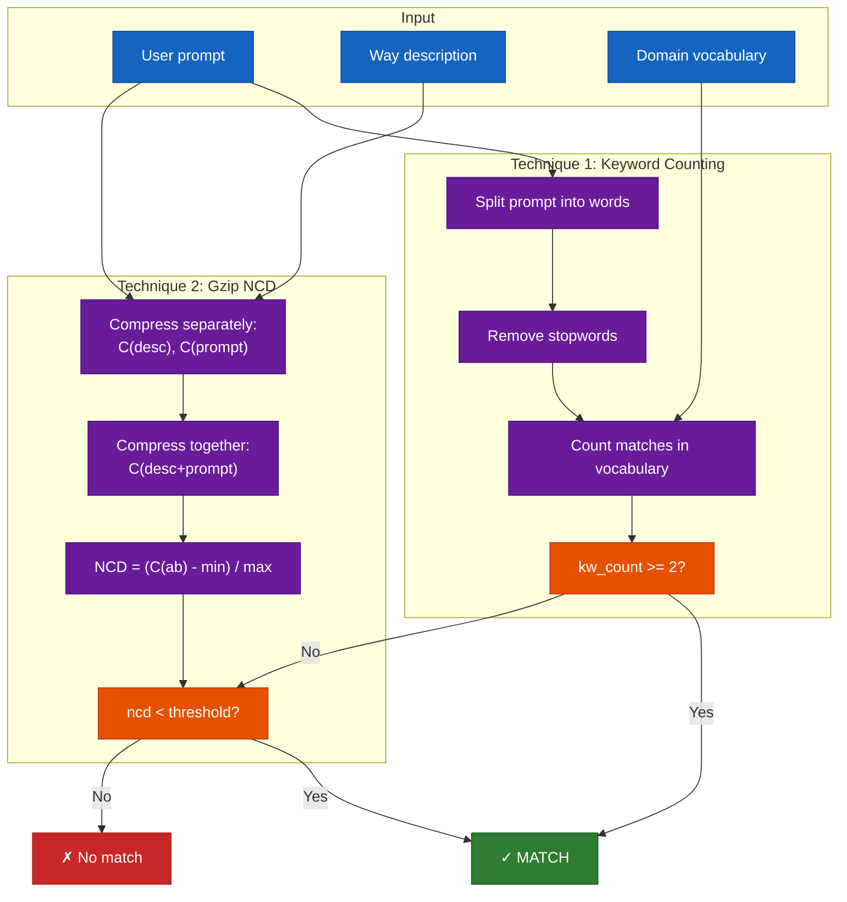

**Why gzip NCD works**: Similar texts share patterns that compress well together.

```
NCD("software design", "design the database schema") = 0.52 (similar)
NCD("software design", "button design looks off")    = 0.63 (different)
```

## Macro Injection

Ways with `macro: prepend|append` run dynamic scripts that query live state:

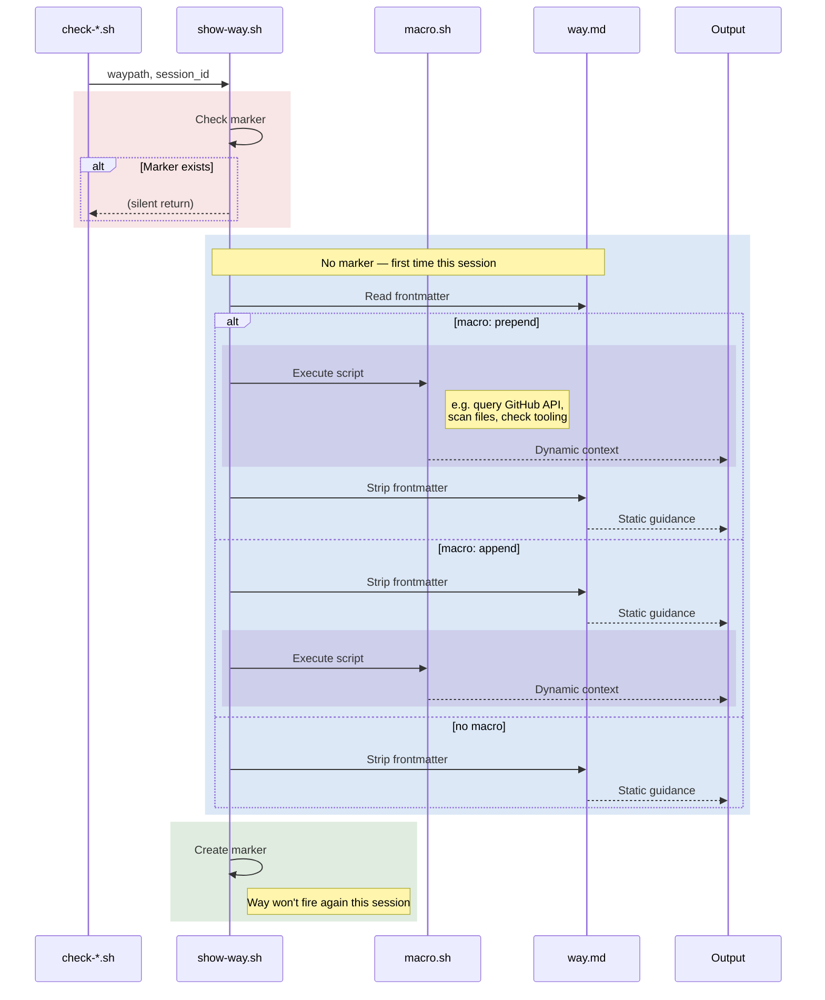

## Directory Structure

```
~/.claude/hooks/ways/
├── core.md                     # Base guidance (loads at startup)
├── macro.sh                    # Generates Available Ways table
├── show-core.sh                # Combines macro output + core.md
├── show-way.sh                 # Once-per-session gating + output
│
├── check-prompt.sh             # UserPromptSubmit → scan patterns
├── check-bash-pre.sh           # PreToolUse:Bash → scan commands
├── check-file-pre.sh           # PreToolUse:Edit|Write → scan files
├── check-task-pre.sh           # PreToolUse:Task → stash for subagent
├── check-state.sh              # UserPromptSubmit → state triggers
├── check-response.sh           # Stop → extract topics for next turn
│
├── inject-subagent.sh          # SubagentStart → emit stashed ways
├── semantic-match.sh           # Gzip NCD + keyword matching
├── model-match.sh              # Haiku subprocess classifier
├── clear-markers.sh            # SessionStart → reset all state
├── mark-tasks-active.sh        # PreToolUse:TaskCreate → context nag gate
│
├── softwaredev/                # Domain: software development
│   ├── commits/way.md          #   git commit format
│   ├── testing/way.md          #   test practices
│   ├── security/way.md         #   auth, secrets, vulnerabilities
│   ├── github/                 #   PR workflow
│   │   ├── way.md
│   │   └── macro.sh            #   detects solo vs team
│   └── ...                     #   18 ways total
├── itops/                      # Domain: IT operations
│   └── ...                     #   4 ways
└── meta/                       # Domain: meta-system
    └── ...                     #   5 ways

$PROJECT/.claude/ways/          # Project-local overrides
└── {domain}/{wayname}/way.md   # Same structure, takes precedence
```

### Script Relationships

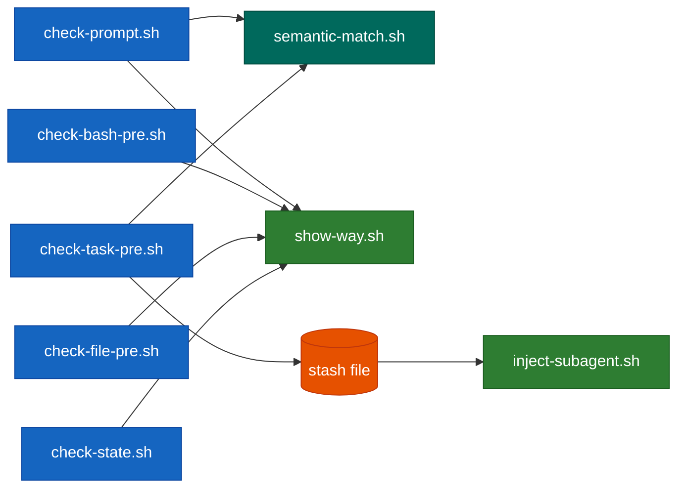

## Multi-Trigger Semantics

What happens when multiple triggers fire:

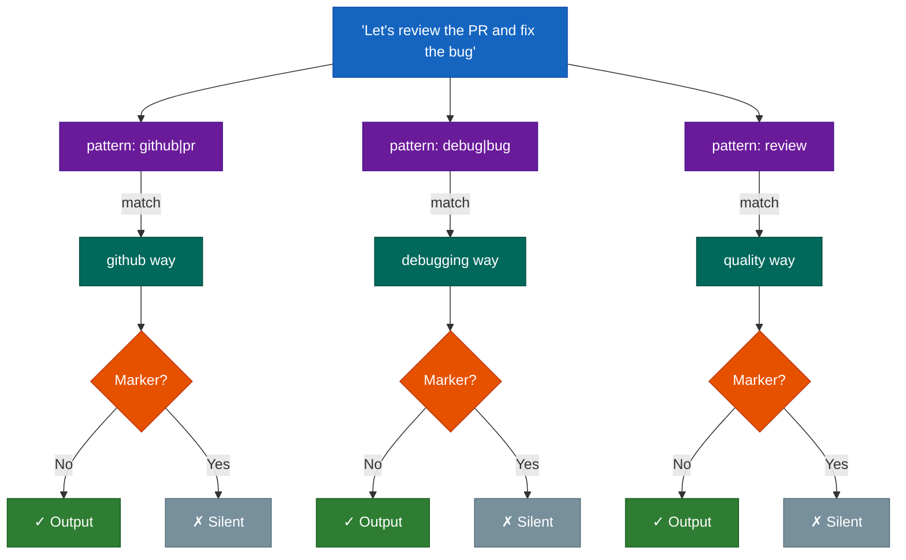

Each way has its own marker - multiple ways can fire from one prompt, but each only fires once per session.

## Project-Local Override

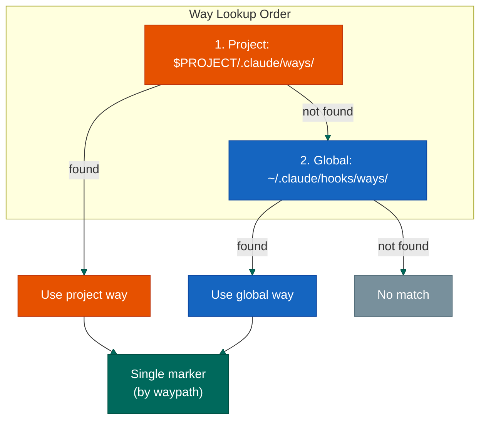

Project ways take precedence. Only one marker per waypath regardless of source.
