# Ways System Architecture

Visual documentation of the ways trigger system.

## How a Session Flows

A typical session from the user's perspective, showing how events trigger way injections at each step:

```mermaid
sequenceDiagram
    participant U as 👤 User
    participant C as 🤖 Claude
    participant W as ⚡ Ways System
    participant S as 🔧 Subagent

    Note over U,S: Session starts — core guidance loads

    rect rgba(21, 101, 192, 0.15)
        Note over U,C: User describes their task
        U->>C: "Let's fix the auth bug and<br/>add tests for the login flow"
        W-->>C: 🔑 Security way injected (keyword: auth)
        W-->>C: 🧪 Testing way injected (keyword: tests)
        W-->>C: 🐛 Debugging way injected (keyword: bug)
        Note right of C: Claude now has security, testing,<br/>and debugging guidance in context
    end

    rect rgba(106, 27, 154, 0.15)
        Note over C,W: Claude uses tools — ways intercept before execution
        C->>W: about to run: git log --oneline auth/
        Note right of W: No way matches → command proceeds
        C->>W: about to edit: src/auth/login.ts
        W-->>C: ⚙️ Config way injected (PreToolUse: file match)
        Note right of C: Guidance arrives before the edit happens
    end

    rect rgba(0, 105, 92, 0.15)
        Note over C,S: Claude delegates to a subagent
        C->>W: about to spawn: Task("Review auth<br/>for security vulnerabilities")
        W-->>W: Stash matched ways (PreToolUse:Task)
        C->>S: Subagent starts
        W-->>S: 🔑 Security way injected (SubagentStart)
        W-->>S: 🐛 Debugging way injected (SubagentStart)
        Note right of S: Subagent has its own way context
        S-->>C: Review findings
    end

    rect rgba(230, 81, 0, 0.15)
        Note over C,W: Macro tailors guidance to project context
        C->>W: about to run: gh pr create
        W->>W: macro.sh → queries GitHub API
        W-->>C: 🔀 GitHub way injected (PreToolUse:Bash)<br/>"Team project (4 contributors) — PR recommended"
        Note right of C: Claude sees team context before<br/>the command executes
    end

    rect rgba(21, 101, 192, 0.15)
        Note over U,C: User continues — ways stay quiet
        U->>C: "Now let's also check the tests"
        Note right of W: Testing way already shown → silent
        Note right of C: No new injections — markers prevent repeats
    end

    Note over U,S: ↻ This cycle continues until context fills up

    rect rgba(198, 40, 40, 0.15)
        Note over U,S: Auto-compact triggers — all markers cleared, ways reset
        W->>W: clear-markers.sh → rm /tmp/.claude-way-*
        W-->>C: Core guidance reloads (fresh session state)
        Note right of C: All ways can fire again on next match
    end
```



## Hook Flow

How ways get triggered during a Claude Code session:

```mermaid
flowchart TB
    classDef event fill:#1565C0,stroke:#0D47A1,color:#fff
    classDef script fill:#6A1B9A,stroke:#4A148C,color:#fff
    classDef match fill:#00695C,stroke:#004D40,color:#fff
    classDef gate fill:#E65100,stroke:#BF360C,color:#fff
    classDef output fill:#2E7D32,stroke:#1B5E20,color:#fff
    classDef silent fill:#78909C,stroke:#546E7A,color:#fff

    subgraph Session["Claude Code Session"]
        SS[SessionStart]:::event --> Core["show-core.sh<br/>Dynamic table + core.md"]:::script

        UP[UserPromptSubmit]:::event --> CP["check-prompt.sh<br/>Regex · Semantic · Model"]:::script

        subgraph PreTool["PreToolUse"]
            Bash[Bash tool]:::event --> CB["check-bash-pre.sh"]:::script
            EditW[Edit/Write tool]:::event --> CF["check-file-pre.sh"]:::script
            Task[Task tool]:::event --> CT["check-task-pre.sh"]:::script
        end

        SA[SubagentStart]:::event --> IS["inject-subagent.sh"]:::script
    end

    CP -->|"match: semantic"| SM["semantic-match.sh<br/>gzip NCD + keywords"]:::match
    CP -->|regex| SW["show-way.sh"]:::script
    SM --> SW
    CB --> SW
    CF --> SW

    SW --> Check{Marker?}:::gate
    Check -->|No| Output["Output way content<br/>Create marker"]:::output
    Check -->|Yes| Silent["No-op"]:::silent

    CT -->|"scope: subagent"| Stash["Write stash file"]:::output
    IS -->|read stash| Emit["Emit way content<br/>(bypass markers)"]:::output
```



## Subagent Injection

Two-phase stash pattern bridges the gap between Task prompt visibility and SubagentStart injection:


### Scope Filtering

The `scope` field controls where ways inject:

```mermaid
flowchart LR
    classDef agent fill:#1565C0,stroke:#0D47A1,color:#fff
    classDef sub fill:#6A1B9A,stroke:#4A148C,color:#fff
    classDef both fill:#00695C,stroke:#004D40,color:#fff
    classDef skip fill:#78909C,stroke:#546E7A,color:#fff

    Way["way.md<br/>scope: ?"]

    Way -->|"scope: agent"| AG["Agent only<br/>check-prompt / bash / file"]:::agent
    Way -->|"scope: subagent"| SB["Subagent only<br/>check-task-pre → inject"]:::sub
    Way -->|"scope: agent, subagent"| BOTH["Both paths<br/>(default for all built-in ways)"]:::both
    Way -->|"no scope field"| DEF["Agent only<br/>(backward compatible)"]:::agent
```



### Parallel Subagent Handling

Multiple Task tools in one message create separate stash files consumed in FIFO order:


## Way State Machine

Each (way, session) pair has exactly two states:

```mermaid
stateDiagram-v2
    classDef notShown fill:#C62828,stroke:#B71C1C,color:#fff,font-weight:bold
    classDef shown fill:#2E7D32,stroke:#1B5E20,color:#fff,font-weight:bold

    [*] --> NotShown: Session starts

    NotShown: not_shown
    NotShown: No marker file exists

    Shown: shown
    Shown: Marker file exists

    NotShown --> Shown: Trigger match → output + create marker
    Shown --> Shown: Trigger match → no-op (idempotent)

    Shown --> [*]: Session ends (markers in /tmp)

    state "not_shown" as NotShown:::notShown
    state "shown" as Shown:::shown
```



**Exception**: Subagent injection bypasses this state machine entirely. Ways injected via `inject-subagent.sh` are emitted without marker checks.

## Trigger Matching

How prompts and tool use get matched to ways:


## Semantic Matching

For ways with `match: semantic`, regex is replaced with gzip NCD + keyword counting:


**Why gzip NCD works**: Similar texts share patterns that compress well together.

```
NCD("software design", "design the database schema") = 0.52 (similar)
NCD("software design", "button design looks off")    = 0.63 (different)
```

## Macro Injection

Ways with `macro: prepend|append` run dynamic scripts that query live state:


## Directory Structure

```
~/.claude/hooks/ways/
├── core.md                     # Base guidance (loads at startup)
├── macro.sh                    # Generates Available Ways table
├── show-core.sh                # Combines macro output + core.md
├── show-way.sh                 # Once-per-session gating + output
│
├── check-prompt.sh             # UserPromptSubmit → scan patterns
├── check-bash-pre.sh           # PreToolUse:Bash → scan commands
├── check-file-pre.sh           # PreToolUse:Edit|Write → scan files
├── check-task-pre.sh           # PreToolUse:Task → stash for subagent
├── check-state.sh              # UserPromptSubmit → state triggers
├── check-response.sh           # Stop → extract topics for next turn
│
├── inject-subagent.sh          # SubagentStart → emit stashed ways
├── semantic-match.sh           # Gzip NCD + keyword matching
├── model-match.sh              # Haiku subprocess classifier
├── clear-markers.sh            # SessionStart → reset all state
├── mark-tasks-active.sh        # PreToolUse:TaskCreate → context nag gate
│
├── softwaredev/                # Domain: software development
│   ├── commits/way.md          #   git commit format
│   ├── testing/way.md          #   test practices
│   ├── security/way.md         #   auth, secrets, vulnerabilities
│   ├── github/                 #   PR workflow
│   │   ├── way.md
│   │   └── macro.sh            #   detects solo vs team
│   └── ...                     #   18 ways total
├── itops/                      # Domain: IT operations
│   └── ...                     #   4 ways
└── meta/                       # Domain: meta-system
    └── ...                     #   5 ways

$PROJECT/.claude/ways/          # Project-local overrides
└── {domain}/{wayname}/way.md   # Same structure, takes precedence
```

### Script Relationships


## Multi-Trigger Semantics

What happens when multiple triggers fire:


Each way has its own marker - multiple ways can fire from one prompt, but each only fires once per session.

## Project-Local Override


Project ways take precedence. Only one marker per waypath regardless of source.
