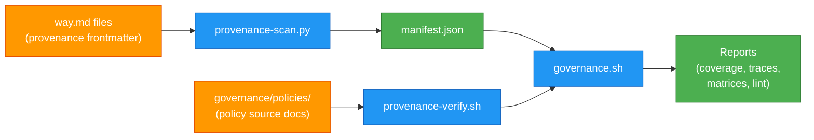

# Governance System

How policy traceability works for ways. This is the reference layer — for getting started, see [governance/README.md](../governance/README.md). For adding provenance to a way, see [provenance.md](hooks-and-ways/provenance.md).

## The Compilation Chain

Ways are compiled policy. A human reads a policy document, interprets it for the agent context, and writes a `way.md` — compressed, directive, stripped of rationale. The governance system makes that compilation traceable.

```
Regulatory Framework    (NIST, ISO, OWASP, SOC 2, CIS, IEEE...)
       ↓
Control Requirement     (NIST SP 800-53 CM-3, OWASP A03:Injection...)
       ↓
Policy Document         (governance/policies/*.md — human prose)
       ↓
Way File                (hooks/ways/*/way.md — compiled guidance)
       ↓
Agent Context           (injected at runtime when triggers match)
```

Each layer compresses the one above it. The regulatory framework is hundreds of pages. The control is a paragraph. The policy is a few pages. The way is 30 lines. The agent sees only the directives — but the full chain is walkable.

## Provenance Metadata

Ways carry optional `provenance:` blocks in their YAML frontmatter:

```yaml
---
pattern: commit|push
provenance:
  policy:
    - uri: governance/policies/code-lifecycle.md
      type: governance-doc
  controls:
    - id: NIST SP 800-53 CM-3 (Configuration Change Control)
      justifications:
        - Conventional commit types classify changes by nature
        - Atomic commits make each change independently reviewable
    - id: SOC 2 CC8.1 (Change Management)
      justifications:
        - Type prefix and scope create structured change records
  verified: 2026-02-05
  rationale: >
    Conventional commits create structured change records with type
    classification and justification.
---
```

**The runtime strips all frontmatter before injection.** Provenance metadata never reaches the agent's context window. Zero tokens. Zero latency. It exists purely for governance — the debug symbols of compiled policy.

### Fields

| Field | Purpose |
|-------|---------|
| `policy[].uri` | Source policy document — relative path or `github://org/repo/path` |
| `policy[].type` | Classification: `adr`, `governance-doc`, `regulatory-framework`, `control-spec` |
| `controls[].id` | Regulatory control this way addresses |
| `controls[].justifications[]` | Specific claims about how guidance satisfies the control |
| `verified` | Date provenance was last confirmed accurate |
| `rationale` | How policy intent became way guidance — the compilation commentary |

## Data Flow



## Tools

### provenance-scan.py

Scans all `way.md` files, extracts `provenance:` blocks from YAML frontmatter, and generates a JSON manifest. No external dependencies — stdlib only.

The manifest contains:
- Per-way provenance data (policy URIs, controls, justifications, verified dates)
- Inverted index: policy document → implementing ways
- Inverted index: control reference → addressing ways
- Coverage statistics

```bash
# Generate to stdout
python3 governance/provenance-scan.py

# Write to file
python3 governance/provenance-scan.py -o provenance-manifest.json
```

### provenance-verify.sh

Reads the manifest and validates structural integrity:
- Every `policy.uri` points to a real file
- Every `verified` date is well-formed and not stale
- Every control has at least one justification

```bash
bash governance/provenance-verify.sh
bash governance/provenance-verify.sh --json
```

### governance.sh (the operator)

Unified CLI that wraps the scanner and verifier with auditor-friendly query modes:

| Mode | Command | Output |
|------|---------|--------|
| **Coverage** | `governance.sh` | Which ways have provenance, which don't |
| **Trace** | `governance.sh --trace softwaredev/commits` | End-to-end chain for one way |
| **Control query** | `governance.sh --control OWASP` | Which ways implement a control |
| **Policy query** | `governance.sh --policy code-lifecycle` | Which ways derive from a policy |
| **Gaps** | `governance.sh --gaps` | Ways without provenance |
| **Stale** | `governance.sh --stale 90` | Ways with old verified dates |
| **Active** | `governance.sh --active` | Cross-reference with way firing stats |
| **Matrix** | `governance.sh --matrix` | Flat spreadsheet: way / control / justification |
| **Lint** | `governance.sh --lint` | Validate provenance integrity |

All modes support `--json` for machine-readable output.

## Policy Source Documents

Policy documents live in `governance/policies/`. These are the human-readable interpretation layer — they explain why a way exists, what principle it implements, what the boundaries are. They're the "source code" that ways compile from.

The governance scanner validates that every `policy.uri` in way frontmatter points to a real file. The provenance chain breaks if policies are moved without updating URIs.

## The Growth Pattern

Governance is optional and additive. Most users never need it. The progression:

1. **Ways** — encode how you do things. Everyone starts here.
2. **Policies** — write down why. Emerges when ways need rationale or when new team members ask "why do we do it this way?"
3. **Provenance** — link ways to policies and controls. Emerges when compliance asks "can you prove your agents follow policy?"
4. **Reporting** — run the governance operator. Emerges when auditors need evidence.

Each step builds on the previous without requiring it. A way without provenance works exactly the same at runtime. Provenance without reporting still documents intent. The system doesn't penalize partial adoption.

## Cross-Repo Pattern

In an enterprise, policy documents and way implementations typically live in separate repositories:

```
compliance-repo/              your-claude-config/
├── docs/architecture/        ├── hooks/ways/
│   ├── ADR-150.md           │   ├── softwaredev/delivery/commits/way.md
│   └── ADR-200.md           │   │   (provenance: → ADR-150)
├── audit-ledger.json        │   └── softwaredev/code/security/way.md
└── controls.xlsx            └── governance/
                                 ├── policies/
                                 └── provenance-manifest.json
```

The provenance frontmatter references policies by URI. The manifest bridges repos at verification time. The verify script supports `--ledger` for cross-referencing external control inventories.

## Analogy

| Concept | Software Build | Governance System |
|---------|---------------|-------------------|
| Source code | `.c` files | `governance/policies/*.md` |
| Compiler | `gcc` | Human authoring process |
| Object code | `.o` files | `hooks/ways/*/way.md` |
| Debug symbols | DWARF / PDB | `provenance:` frontmatter block |
| Symbol table | `.map` file | `provenance-manifest.json` |
| Build system | `make` | `governance.sh` |
