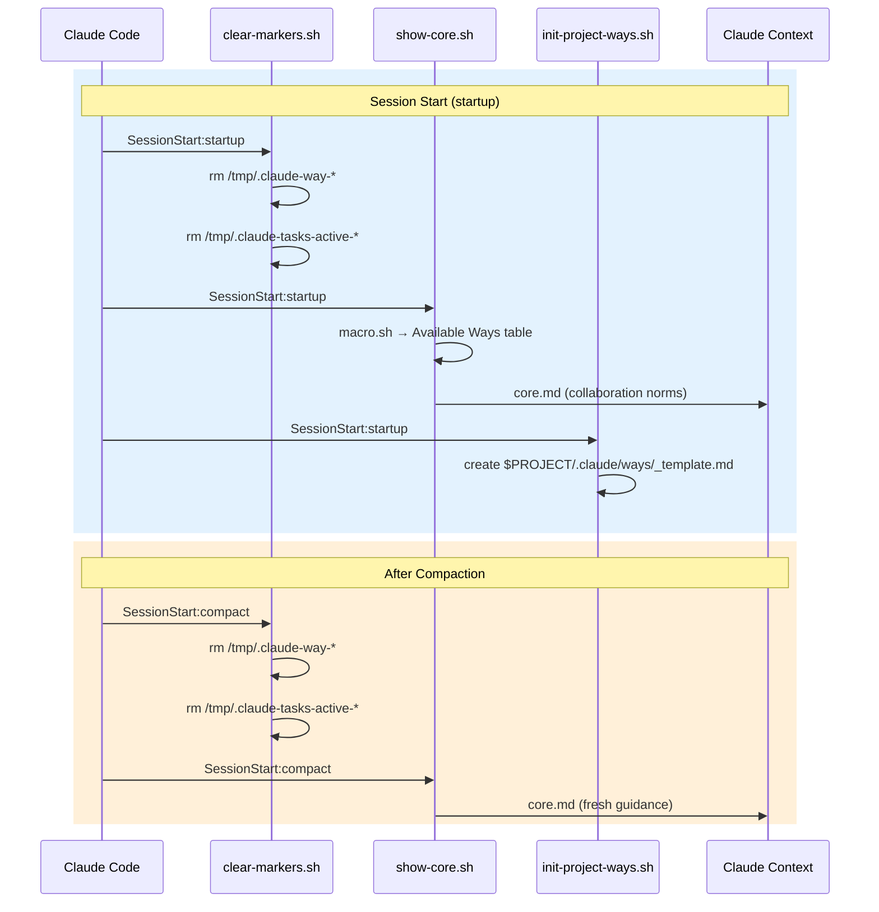
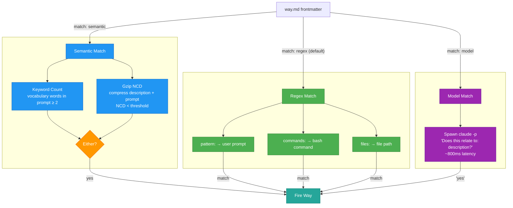
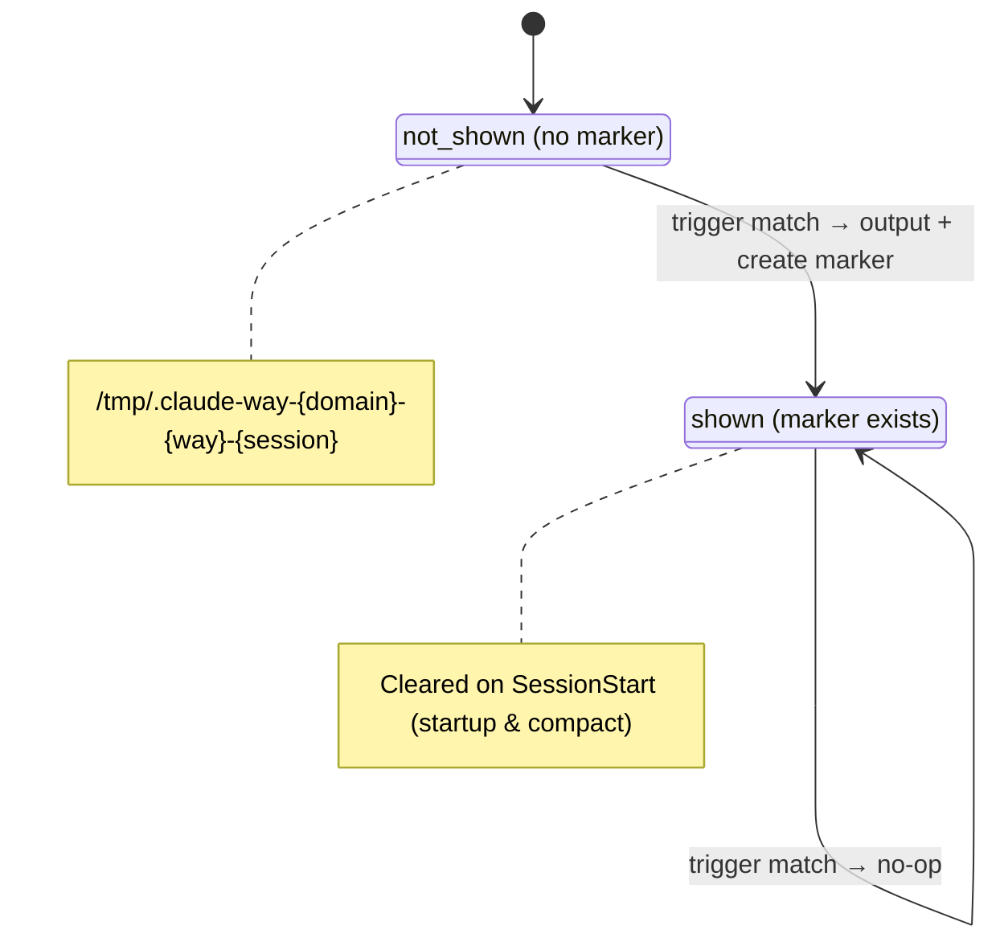
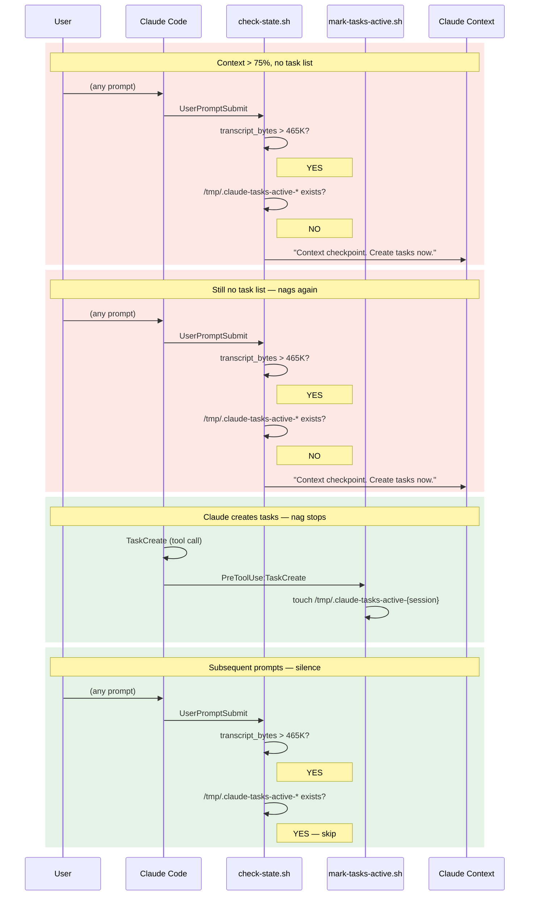
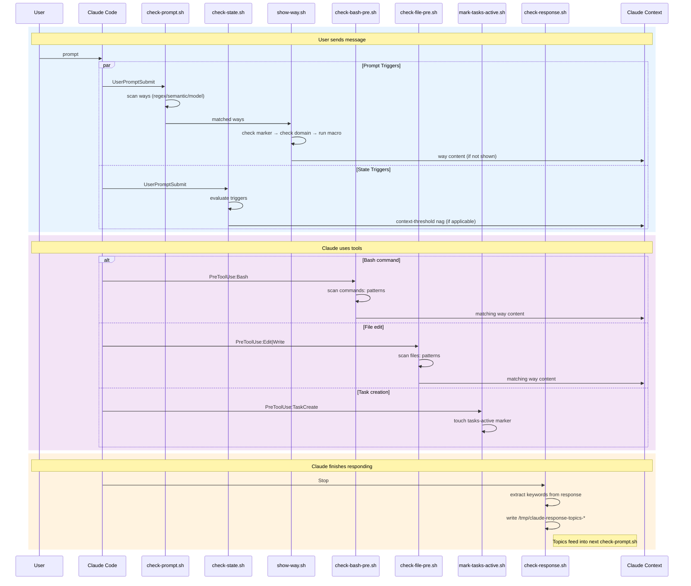
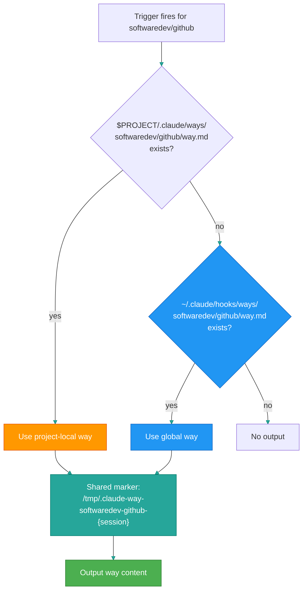

# Hooks and Ways System

How contextual guidance gets injected into Claude Code sessions.

## Hook Events

Four Claude Code hook events drive the system. Each fires shell scripts that scan for matching ways and inject their content.

| Event | When | Scripts |
|-------|------|---------|
| **SessionStart** (startup) | Fresh session | `clear-markers.sh`, `show-core.sh`, `init-project-ways.sh`, `check-config-updates.sh` |
| **SessionStart** (compact) | After compaction | `clear-markers.sh`, `show-core.sh` |
| **UserPromptSubmit** | Every user message | `check-prompt.sh`, `check-state.sh` |
| **PreToolUse** (Edit\|Write) | Before file edit | `check-file-pre.sh` |
| **PreToolUse** (Bash) | Before command | `check-bash-pre.sh` |
| **PreToolUse** (TaskCreate) | Before task creation | `mark-tasks-active.sh` |
| **Stop** | After Claude responds | `check-response.sh` |

## What Each Script Does

### Session Lifecycle

- **`clear-markers.sh`** - Removes all `/tmp/.claude-way-*` and `/tmp/.claude-tasks-active-*` markers. Resets session state so ways can fire fresh.
- **`show-core.sh`** - Runs `macro.sh` to generate the Available Ways table, then outputs `core.md` (collaboration style, communication norms). This is the initial context Claude sees.
- **`init-project-ways.sh`** - Creates `$PROJECT/.claude/ways/_template.md` if the project has a `.claude/` or `.git/` dir but no ways directory yet.
- **`check-config-updates.sh`** - Once-per-day check for plugin updates.

### Trigger Evaluation

- **`check-prompt.sh`** - Scans all ways for `pattern:` (regex), `match: semantic`, or `match: model` fields. Tests the user's prompt against each. Fires matching ways via `show-way.sh`.
- **`check-bash-pre.sh`** - Scans ways for `commands:` patterns. Tests the command about to run. Also checks `pattern:` against the command description.
- **`check-file-pre.sh`** - Scans ways for `files:` patterns. Tests the file path about to be edited.
- **`check-state.sh`** - Evaluates `trigger:` fields (context-threshold, file-exists, session-start). See [State Triggers](#state-triggers).

### State Management

- **`mark-tasks-active.sh`** - Creates `/tmp/.claude-tasks-active-{session_id}`. Silences the context-threshold nag.
- **`check-response.sh`** - Extracts technical keywords from Claude's last response, writes to `/tmp/claude-response-topics-{session_id}`. These topics feed back into `check-prompt.sh` on the next turn, so ways can trigger based on what Claude discussed (not just what the user asked).

### Way Display

- **`show-way.sh`** - The central display function. Given a way path and session ID: checks domain disable list, checks marker, runs macro if configured, outputs content (stripping frontmatter), creates marker.
- **`macro.sh`** - Generates the dynamic Available Ways table by scanning all `way.md` files and extracting their trigger patterns.

## Session Lifecycle



## Way Matching Modes

Each way declares how it should be matched in its YAML frontmatter.



### Regex

```yaml
pattern: commit|push          # matched against user prompt
commands: git\ commit         # matched against bash commands
files: \.env$|config\.json    # matched against file paths
```

Fast and precise. Most ways use this.

### Semantic

```yaml
match: semantic
description: "API design, REST endpoints, request handling"
vocabulary: api endpoint route handler middleware
threshold: 0.55
```

Two-technique approach:
1. **Keyword counting** - counts vocabulary words in the prompt (match if >= 2)
2. **Gzip NCD** - compresses description + prompt together; similar text compresses better (match if NCD < threshold)

Either technique succeeding triggers the way.

### Model

```yaml
match: model
description: "security-sensitive operations, auth changes, credential handling"
```

Spawns a minimal Claude subprocess to classify yes/no. Most accurate but adds ~800ms latency.

## State Triggers

Evaluated by `check-state.sh` on every UserPromptSubmit. Unlike pattern-based ways, these fire based on session conditions.

### context-threshold

```yaml
trigger: context-threshold
threshold: 75
```

Estimates transcript size since last compaction (~4 chars/token, ~155K token window = ~620K chars). Fires when `transcript_bytes > 620K * threshold%`.

**Special behavior**: Does not use the standard marker system. Repeats on every prompt until a `/tmp/.claude-tasks-active-{session_id}` marker exists (created by `mark-tasks-active.sh` when `TaskCreate` is used).

### file-exists

```yaml
trigger: file-exists
path: .claude/todo-*.md
```

Fires once (standard marker) if the glob pattern matches any file relative to the project directory.

### session-start

```yaml
trigger: session-start
```

Always evaluates true. Uses standard marker, so fires exactly once per session on the first UserPromptSubmit.

## Once-Per-Session Gating

Most ways fire once then go silent for the rest of the session.



**Exception**: context-threshold triggers bypass this system entirely. They repeat until the tasks-active marker exists.

## The Context-Threshold Nag

The `meta/todos` way uses context-threshold to ensure task lists exist before compaction.



## Full Data Flow



## Macros

Ways can include a `macro.sh` alongside `way.md`. Frontmatter declares positioning:

```yaml
macro: prepend   # macro output before static content
macro: append    # macro output after static content
```

Macros generate dynamic content. Examples:
- `softwaredev/adr/macro.sh` - Tri-state detection: no tooling, tooling available, tooling installed
- `softwaredev/quality/macro.sh` - Scans for long files in the project, outputs priority list
- `softwaredev/github/macro.sh` - Detects solo vs team project, adjusts PR guidance

**Security**: Project-local macros only run if the project is listed in `~/.claude/trusted-project-macros`.

## Project-Local Ways

Projects can override or add ways at `$PROJECT/.claude/ways/{domain}/{way}/way.md`. Project-local takes precedence over global. Same-path ways share a marker, so only one fires.



## Domain Enable/Disable

`~/.claude/ways.json` controls which domains are active:

```json
{
  "disabled": ["itops"]
}
```

Checked by `show-way.sh` before outputting any way.
