# Hooks and Ways System

How contextual guidance gets injected into Claude Code sessions.

## Hook Events

Six Claude Code hook events drive the system. Each fires shell scripts that scan for matching ways and inject their content.

| Event | When | Scripts |
|-------|------|---------|
| **SessionStart** (startup) | Fresh session | `clear-markers.sh`, `show-core.sh`, `init-project-ways.sh`, `check-config-updates.sh` |
| **SessionStart** (compact) | After compaction | `clear-markers.sh`, `show-core.sh` |
| **UserPromptSubmit** | Every user message | `check-prompt.sh`, `check-state.sh` |
| **PreToolUse** (Edit\|Write) | Before file edit | `check-file-pre.sh` |
| **PreToolUse** (Bash) | Before command | `check-bash-pre.sh` |
| **PreToolUse** (Task) | Before subagent spawn | `check-task-pre.sh` |
| **PreToolUse** (TaskCreate) | Before task creation | `mark-tasks-active.sh` |
| **SubagentStart** | When subagent starts | `inject-subagent.sh` |
| **Stop** | After Claude responds | `check-response.sh` |

## What Each Script Does

### Session Lifecycle

- **`clear-markers.sh`** - Removes all `/tmp/.claude-way-*`, `/tmp/.claude-tasks-active-*` markers, and `/tmp/.claude-subagent-stash-*` dirs. Resets session state so ways can fire fresh.
- **`show-core.sh`** - Runs `macro.sh` to generate the Available Ways table, then outputs `core.md` (collaboration style, communication norms). This is the initial context Claude sees.
- **`init-project-ways.sh`** - Creates `$PROJECT/.claude/ways/_template.md` if the project has a `.claude/` or `.git/` dir but no ways directory yet.
- **`check-config-updates.sh`** - Checks if the config is behind upstream. Detects four install scenarios: direct clones, GitHub forks, renamed clones (via `.claude-upstream` marker file), and plugin installs. Network calls (`git fetch`, `gh api`, `git ls-remote`) are rate-limited to once per hour; update notices fire every session when behind. See the [Updating](#updating) section of the README for scenario details and how to control this behavior.

### Trigger Evaluation

These scripts fire on **PreToolUse** — before the tool executes, not after. This is a critical design choice: guidance must arrive while Claude can still act on it. A commit format reminder after the commit is too late. Security guidance after the file edit is too late. The "Pre" in PreToolUse means Claude sees the way content and can adjust its behavior before the action happens.

- **`check-prompt.sh`** - Scans all ways for `pattern:` (regex) and `description:`+`vocabulary:` (BM25 semantic) fields. Sources `match-way.sh` for shared matching logic. Matching is additive — either channel firing activates the way. Semantic matching degrades: BM25 binary → gzip NCD → skip. Fires matching ways via `show-way.sh`.
- **`check-bash-pre.sh`** - Scans ways for `commands:` patterns. Tests the command about to run. Also checks `pattern:` against the command description.
- **`check-file-pre.sh`** - Scans ways for `files:` patterns. Tests the file path about to be edited.
- **`check-state.sh`** - Evaluates `trigger:` fields (context-threshold, file-exists, session-start). See [State Triggers](#state-triggers).

All trigger evaluation scripts respect the `scope:` frontmatter field - ways without `agent` scope are skipped.

### Subagent Injection

- **`check-task-pre.sh`** - PreToolUse:Task hook (Phase 1). Reads the Task tool's `prompt` parameter, scans ways with `scope: subagent`, matches using `match-way.sh` (same additive logic as `check-prompt.sh`). Writes matched way paths to `/tmp/.claude-subagent-stash-{session_id}/`. Never blocks Task creation.
- **`inject-subagent.sh`** - SubagentStart hook (Phase 2). Reads the oldest stash file, claims it atomically, emits way content as JSON `hookSpecificOutput.additionalContext`. Bypasses markers entirely - subagents get fresh context regardless of what the parent triggered.
- **`match-way.sh`** - Shared matching function sourced by `check-prompt.sh` and `check-task-pre.sh`. Provides `detect_semantic_engine()` (BM25 → NCD → none) and `match_way_prompt()` (additive pattern OR semantic). Single source of truth for the degradation chain.

### State Management

- **`mark-tasks-active.sh`** - Creates `/tmp/.claude-tasks-active-{session_id}`. Silences the context-threshold nag.
- **`check-response.sh`** - Extracts technical keywords from Claude's last response, writes to `/tmp/claude-response-topics-{session_id}`. These topics feed back into `check-prompt.sh` on the next turn, so ways can trigger based on what Claude discussed (not just what the user asked).

### Way Display

- **`show-way.sh`** - The central display function. Given a way path and session ID: checks domain disable list, checks marker, runs macro if configured, outputs content (stripping frontmatter), creates marker.
- **`macro.sh`** - Generates the dynamic Available Ways table by scanning all `way.md` files and extracting their trigger patterns.

## Session Lifecycle


## Way Scope

The `scope:` frontmatter field controls where a way fires. There are three scopes, reflecting the three types of Claude Code sessions:

| Scope | Session type | Detection |
|-------|-------------|-----------|
| `agent` | Your main session | Default (no marker file) |
| `teammate` | Named agent in a coordinated team | `/tmp/.claude-teammate-{session_id}` exists |
| `subagent` | Quick Task tool delegate | Spawned via Task without `team_name` |

Ways declare which scopes they apply to:

```yaml
scope: agent                     # Main session only (default if omitted)
scope: teammate                  # Team members only
scope: agent, teammate           # Both, but not quick delegates
scope: agent, subagent           # Main + delegates, not teammates
scope: agent, teammate, subagent # Everyone
```

### Scope Detection

Detection runs via `detect-scope.sh`, which every trigger evaluation script sources. It checks for a teammate marker file — if one exists, the scope is `teammate`; otherwise `agent`. Subagent scope is determined at injection time by `check-task-pre.sh`, not by the running session itself.

The teammate marker is created by `inject-subagent.sh` during Phase 2 of the two-phase injection. It persists for the teammate's entire session lifetime and contains the team name (used for telemetry).

### What Gets Gated

| Way | Scope | Why |
|-----|-------|-----|
| `meta/memory` | `agent` | Prevents concurrent MEMORY.md writes from multiple teammates |
| `meta/subagents` | `agent` | Delegation guidance is irrelevant to agents that are themselves delegated work |
| `meta/teams` | `teammate` | Coordination norms only make sense for team members |

Subagent injection bypasses the marker system entirely. A way can fire for the parent (marker-gated) AND separately for each subagent or teammate (no markers). The parent's way guidance doesn't automatically transfer because the Task prompt is a compact delegation — the scope system bridges this gap.

See [teams.md](hooks-and-ways/teams.md) for the full team coordination model.

## Way Matching Modes

Each way declares how it should be matched in its YAML frontmatter.

```mermaid
flowchart TD
    classDef regex fill:#2E7D32,stroke:#1B5E20,color:#fff
    classDef semantic fill:#1565C0,stroke:#0D47A1,color:#fff
    classDef decision fill:#E65100,stroke:#BF360C,color:#fff
    classDef result fill:#00695C,stroke:#004D40,color:#fff

    W[way.md frontmatter]
    W -->|"pattern: / commands: / files:"| R
    W -->|"description: + vocabulary:"| S

    subgraph RX ["Pattern Matching"]
        R[Regex Match]:::regex
        R --> RP["pattern: → user prompt"]:::regex
        R --> RC["commands: → bash command"]:::regex
        R --> RF["files: → file path"]:::regex
    end

    subgraph SM ["Semantic Matching (additive)"]
        S[BM25 Scorer]:::semantic
        S --> BM["way-match pair<br/>Porter2 stemming + IDF"]:::semantic
        S -.->|"fallback"| NCD["Gzip NCD<br/>if binary unavailable"]:::semantic
    end

    RP -->|match| FIRE[Fire Way]:::result
    RC -->|match| FIRE
    RF -->|match| FIRE
    BM -->|"score ≥ threshold"| FIRE
    NCD -->|"NCD &lt; 0.58"| FIRE
```



Matching is **additive** — pattern and semantic are OR'd. A way with both `pattern:` and `description:`+`vocabulary:` can fire from either channel.

### Pattern

```yaml
pattern: commit|push          # matched against user prompt
commands: git\ commit         # matched against bash commands
files: \.env$|config\.json    # matched against file paths
```

Fast and precise. Most ways use this.

### Semantic (BM25)

```yaml
description: "API design, REST endpoints, request handling"
vocabulary: api endpoint route handler middleware
threshold: 2.0
```

Scores description+vocabulary against the user's prompt using Okapi BM25 with Porter2 stemming. Degrades: BM25 binary → gzip NCD fallback → skip.

## State Triggers

Evaluated by `check-state.sh` on every UserPromptSubmit. Unlike pattern-based ways, these fire based on session conditions.

### context-threshold

```yaml
trigger: context-threshold
threshold: 75
```

Estimates transcript size since last compaction (~4 chars/token, ~155K token window = ~620K chars). Fires when `transcript_bytes > 620K * threshold%`.

**Special behavior**: Does not use the standard marker system. Repeats on every prompt until a `/tmp/.claude-tasks-active-{session_id}` marker exists (created by `mark-tasks-active.sh` when `TaskCreate` is used).

### file-exists

```yaml
trigger: file-exists
path: .claude/todo-*.md
```

Fires once (standard marker) if the glob pattern matches any file relative to the project directory.

### session-start

```yaml
trigger: session-start
```

Always evaluates true. Uses standard marker, so fires exactly once per session on the first UserPromptSubmit.

## Once-Per-Session Gating

Most ways fire once then go silent for the rest of the session.


**Exceptions**:
- Context-threshold triggers bypass this system entirely - they repeat until the tasks-active marker exists.
- Subagent injection (`inject-subagent.sh`) bypasses markers completely - each subagent gets fresh way content.

## The Context-Threshold Nag

The `meta/todos` way uses context-threshold to ensure task lists exist before compaction.


## Full Data Flow


## Macros

Ways can include a `macro.sh` alongside `way.md`. Frontmatter declares positioning:

```yaml
macro: prepend   # macro output before static content
macro: append    # macro output after static content
```

Macros generate dynamic content. Examples:
- `softwaredev/architecture/adr/macro.sh` - Tri-state detection: no tooling, tooling available, tooling installed
- `softwaredev/code/quality/macro.sh` - Scans for long files in the project, outputs priority list
- `softwaredev/delivery/github/macro.sh` - Detects solo vs team project, adjusts PR guidance

**Security**: Project-local macros only run if the project is listed in `~/.claude/trusted-project-macros`.

## Project-Local Ways

Projects can override or add ways at `$PROJECT/.claude/ways/{domain}/{way}/way.md`. Project-local takes precedence over global. Same-path ways share a marker, so only one fires.


## Domain Enable/Disable

`~/.claude/ways.json` controls which domains are active:

```json
{
  "disabled": ["itops"]
}
```

Checked by `show-way.sh` before outputting any way.

## Testing

Three test layers verify the matching and injection pipeline. See [tests/README.md](../tests/README.md) for full details.

| Layer | Command | What it tests |
|-------|---------|---------------|
| **Fixture** | `bash tools/way-match/test-harness.sh` | BM25 vs NCD scorer accuracy (32 prompts, fixed corpus) |
| **Integration** | `bash tools/way-match/test-integration.sh` | Real way files, frontmatter extraction, multi-way discrimination |
| **Activation** | `read and run the activation test at tests/way-activation-test.md` | Live hook pipeline: regex, BM25, negative control, subagent injection |

The `/test-way` skill provides ad-hoc scoring for vocabulary tuning:

```
/test-way "write some unit tests for this module"
```
