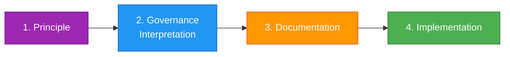
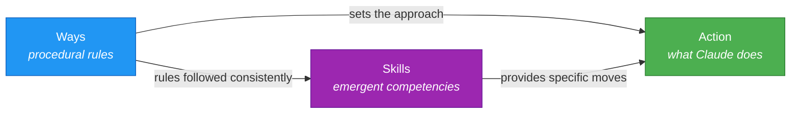

# Start Here

This directory documents a system for injecting contextual guidance into Claude Code sessions. If you're new to it, read this page first.

## The Pipeline

Ways are the end product of a pipeline that starts with opinions and ends with machine-readable guidance. Each stage has a different audience and purpose.

### 1. Principle

An opinion about how things should work. This might come from experience, organizational policy, industry standards, or hard-won lessons.

*Example: "Errors should be caught at system boundaries, not deep inside business logic."*

Principles are the raw input. They don't need to be formalized - they just need to be articulated clearly enough to act on.

### 2. Governance Interpretation

How that principle applies in practice. This is where the principle meets the real world: what does it mean for this team, this stack, this workflow? What are the boundaries, exceptions, and trade-offs?

*Example: "Catch at API endpoints, CLI entry points, and message handlers. Wrap with context at module boundaries. Let programmer errors crash. Handle operational errors gracefully."*

This is the human-readable policy layer. It lives in these docs (`docs/hooks-and-ways/`). Someone reading it should understand not just the rule but the reasoning.

### 3. Documentation

How the implementation works. The reference layer (`docs/hooks-and-ways.md`) describes the system mechanics: which hooks fire when, how matching works, what the data flow looks like. This is the bridge between understanding the "why" (governance) and understanding the "how" (implementation).

### 4. Implementation

The actual way files (`hooks/ways/*/way.md`) and macros (`macro.sh`). These are tuned for Claude's context window - terse, directive, structured for a language model. They read differently from normal documentation because every token in the context window has a cost.

## Where Things Live

```mermaid
flowchart TD
    classDef policy fill:#FF9800,stroke:#E65100,color:#fff
    classDef ref fill:#2196F3,stroke:#1565C0,color:#fff
    classDef machine fill:#4CAF50,stroke:#2E7D32,color:#fff

    subgraph POL ["Policy Layer (human prose)"]
        direction TB
        R[rationale.md]
        M[matching.md]
        MA[macros.md]
        E[extending.md]
        SD["softwaredev/*.md"]
        IT[itops.md]
        ME[meta.md]
    end

    subgraph REF ["Reference Layer (human-machine bridge)"]
        HW["hooks-and-ways.md<br/>(diagrams, mechanics, data flow)"]
    end

    subgraph MAC ["Machine Layer (LLM prompts)"]
        direction TB
        W1["hooks/ways/softwaredev/*/way.md"]
        W2["hooks/ways/itops/*/way.md"]
        W3["hooks/ways/meta/*/way.md"]
        M1["*/macro.sh"]
    end

    POL:::policy
    REF:::ref
    MAC:::machine
```

| Layer | Location | Read by | Purpose |
|-------|----------|---------|---------|
| Policy | `docs/hooks-and-ways/*.md` | Humans | Rationale, 5W1H, governance interpretation |
| Reference | `docs/hooks-and-ways.md` | Humans + Claude | System mechanics, diagrams, data flow |
| Machine | `hooks/ways/*/way.md` | Claude (via hooks) | Terse, directive, context-optimized guidance |

## Ways vs Skills

Claude Code has a built-in feature called **Skills** (`~/.claude/skills/`). Ways and Skills serve different purposes and operate at different levels of abstraction.

**Ways are the procedural rules** - the process, the approach, the "how we do things here." They fire based on what's happening in the session (tools being used, files being edited, context filling up) and inject the rules of engagement for that category of work.

**Skills emerge from following those rules.** When the ways are internalized - when the process is consistently applied - specific capabilities develop. A skill is a crystallized competency: "here's exactly how to do this specific thing." Claude selects skills by matching user intent to the skill's description.

| | Ways | Skills |
|--|------|--------|
| **Nature** | Process rules | Emergent competencies |
| **Granularity** | Category of work | Specific task |
| **Content** | "How we approach this" | "How to do this" |
| **Trigger** | Patterns, tools, state conditions | Semantic intent matching |
| **Persistence** | Once per session (usually) | Always available when matched |
| **Example** | "Cloud CLIs: verify auth, be region-explicit, flag costs" | "Query GCP billing: run `gcloud billing...`" |

The relationship is generative: ways produce the conditions for skills to be effective. A skill for rotating an AWS key works better when the security way has already established "never commit secrets, always verify credentials." The skill provides the specific steps; the way provides the judgment framework around them.

**When to write a way vs a skill:**
- If the knowledge is *process* that applies across many situations → way
- If the knowledge is a *specific capability* that emerged from practice → skill
- If you need to trigger on *tool use or session state* → way (skills can't detect these)
- If you need *tool restrictions* (`allowed-tools`) → skill (ways can't restrict tools)

## Adding a New Way: The Process

Don't start by writing `way.md`. Start at stage 1.

### Step 1: Articulate the principle

What's the opinion? Why does it matter? Write it down plainly. If you can't explain it in a paragraph, it's not clear enough to implement.

### Step 2: Interpret for governance

How does this apply in practice? Write the prose doc (or add a section to an existing one under `docs/hooks-and-ways/`). Cover:

- **What** the guidance is
- **Why** it exists (the principle behind it)
- **When** it applies (and when it doesn't)
- **How** it manifests in concrete actions
- **Who** it affects (the developer? Claude? both?)
- **Where** the boundaries are (what's in scope, what's not)

### Step 3: Document the trigger

Decide how the guidance should be delivered:
- On what user prompt keywords? → `pattern:`
- On what tool use? → `commands:` or `files:`
- On what concept? → `match: semantic`
- On what condition? → `trigger:`

Add this to the reference doc if the trigger mechanism is novel.

### Step 4: Implement the way

Write `way.md` with the frontmatter and guidance content. The content should be the governance interpretation *compressed for context efficiency*. Strip rationale, strip explanation, keep directives and examples.

If the way needs dynamic content, add `macro.sh`.

Test by triggering it and verifying the guidance is actionable.

### Step 5: Connect the layers

The policy doc should reference which way implements it. The way doesn't need to reference the policy doc (it would waste context tokens), but the connection should be traceable by a human reading the docs.

## Reading Order

If you want to understand the system:
1. **This file** — you're here
2. **[rationale.md](rationale.md)** — why this exists
3. **[../hooks-and-ways.md](../hooks-and-ways.md)** — how it works (reference)
4. **Domain docs** — the policy for each group of ways

If you want to add or modify ways:
1. **[extending.md](extending.md)** — how to create ways
2. **[matching.md](matching.md)** — choosing a trigger strategy
3. **[macros.md](macros.md)** — if you need dynamic content

If you're running agent teams:
1. **[teams.md](teams.md)** — scope detection, coordination norms, the three-scope model
2. **[stats.md](stats.md)** — observability, interpreting the telemetry
3. **[meta.md](meta.md)** — the meta ways (teams, memory, todos, tracking)
