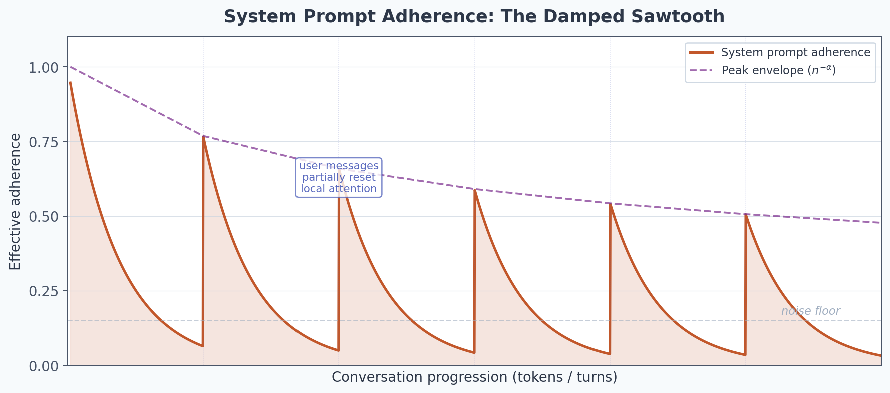
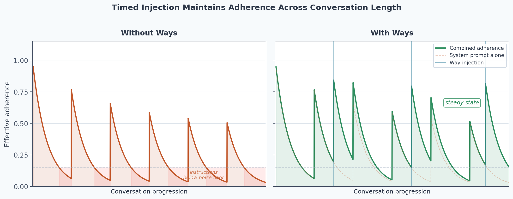
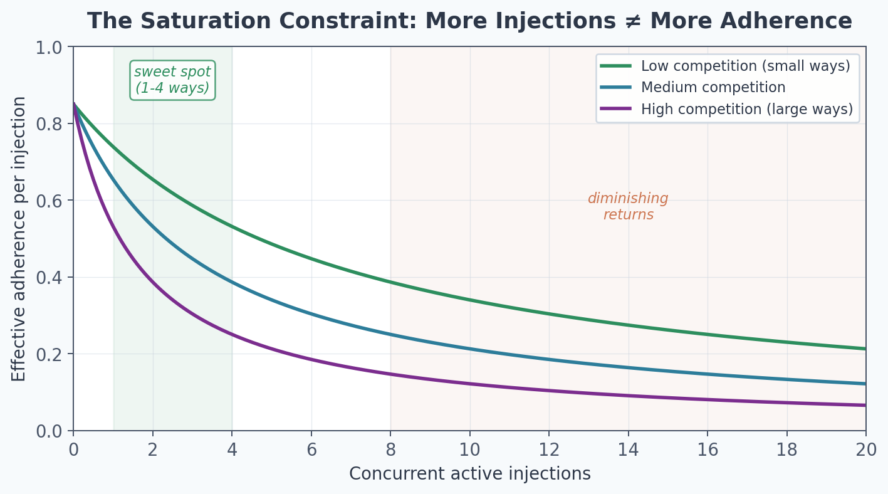

# The Context Decay Model: Why Timed Injection Beats Front-Loading

Ways are a progressive disclosure system for LLM context. This document explains the attention mechanics that make timed injection outperform monolithic system prompts — not as analogy, but as a description of the inference dynamics that govern how models use instructions.

## The Decay Problem

During inference, a model's adherence to system prompt instructions decays with two independent factors:

1. **Turn decay** ($n^{-\alpha}$): As conversation turns accumulate, the system prompt recedes in positional distance. Each turn pushes it further from the attention cursor. The model's peak adherence to those instructions drops monotonically.

2. **Within-generation decay** ($t_{\text{local}}^{-\beta}$): Within a single generation, attention to the system prompt fades as more tokens are produced. Each token the model generates competes for the same attention budget.

The combined effect:

$$A(t) \approx A_0 \cdot n^{-\alpha} \cdot t_{\text{local}}^{-\beta}$$

Where $A(t)$ is effective adherence at time $t$, $A_0$ is initial adherence strength, $n$ is the conversation turn count, and $t_{\text{local}}$ is token count since the last user message.

Each user message partially resets $t_{\text{local}}$ (the local factor), creating a brief spike in attention to earlier context. But the peak of each spike is lower than the last, because $n$ has incremented. The result is a **damped sawtooth**: attention spikes at each turn boundary, but the envelope of those spikes always drops.

By mid-conversation, the system prompt's effective influence has decayed below the noise floor. The model hasn't "forgotten" the instructions — they're still in the context window — but positional distance has reduced their weight in the attention computation to the point where recent context dominates.

This is why long conversations feel like the model "lost its instructions." It did, in the attention-weighted sense that matters during generation.

## The Implicit Scope Problem

There's a second failure mode that compounds decay. When a user says "commit this code," the intent is typically not just "run git commit." It's "run git commit *following the project's commit conventions, with a well-structured message, avoiding secrets, using conventional commit format*" — an implicitly unbounded scope of substantiating details.

The model follows the locally most probable path from the prompt. Like gradient descent, it finds the nearest minimum: the literal instruction. The substantiating details were supposed to come from the system prompt, but by the time the model is generating a commit command at turn 15, those instructions have decayed below the threshold where they'd influence the output.

The system prompt was the right place for this information. The problem isn't content — it's position.

## How Injection Changes the Topology

Ways change where guidance enters the context. Instead of one large block at position zero, ways deliver small, relevant fragments near the attention cursor at the moment they matter:

$$A(t) \approx \underbrace{A_0 \cdot n^{-\alpha} \cdot t_{\text{local}}^{-\beta}}_{\text{system prompt (decaying)}} + \underbrace{A_{\text{inject}} \cdot t_{\text{since\_inject}}^{-\beta}}_{\text{injected way (fresh)}}$$

The critical difference: the injection term carries only the local decay factor ($t_{\text{since\_inject}}^{-\beta}$), not the turn-count envelope ($n^{-\alpha}$). The injection isn't pinned at position zero — it's near the cursor, regardless of how many turns have elapsed. Its positional distance is always small.

The original system prompt still fades. But the injected guidance maintains its peak. The sawtooth stops damping and reaches a **steady state** — adherence oscillates around a constant level instead of decaying to zero.

## Progressive Disclosure

This is progressive disclosure applied to the model itself.

In UX design, progressive disclosure means: don't show the user everything at once. Reveal controls and information as they become relevant to the current task. The principle works because humans have limited working memory — front-loading information wastes the budget on things that aren't yet actionable.

Ways apply the same principle to transformer attention. The context window is the working memory. The attention budget is finite. Front-loading a 500-line system prompt wastes most of that budget on guidance that isn't relevant to the current action.

The system prompt is the settings page nobody reads. Ways are the tooltip that appears when you hover over the button.

| UX Progressive Disclosure | Ways Progressive Disclosure |
|---|---|
| Reveal controls when relevant | Inject guidance at state transitions |
| Don't overwhelm with options | Don't fill context with irrelevant rules |
| Match information to task phase | Match guidance to tool being invoked |
| Settings page vs. contextual tooltip | Monolithic prompt vs. timed injection |

The design heuristic follows directly: when authoring a way, the question isn't "what does Claude need to know?" but "what does Claude need to know *right now*?" The first question produces system prompts. The second produces ways.

## The Saturation Constraint

The model implies a practical limit. If too many ways fire simultaneously, they compete for the same local attention budget. Each additional injection dilutes the effective $A_{\text{inject}}$ of every other active injection:

$$A_{\text{effective}} \approx \frac{A_{\text{inject}}}{1 + k \cdot N_{\text{concurrent}}}$$

Where $N_{\text{concurrent}}$ is the number of simultaneously active injections and $k$ is a competition coefficient.

This is why ways are designed to be small (20-60 lines each), fire once per session (marker-gated deduplication), and trigger selectively (BM25 scoring, not blanket activation). The goal is high signal-to-noise at the cursor position, not maximum information delivered. Three precisely timed injections outperform twenty simultaneous ones.

## Steady-State Adherence

The combination of these mechanisms — timed injection, once-per-session gating, selective triggering — produces a system that maintains consistent instruction adherence regardless of conversation length:

| Mechanism | What It Controls |
|---|---|
| Timed injection | Resets positional decay ($t_{\text{since\_inject}}$) |
| Selective triggering | Maintains signal-to-noise ratio |
| Once-per-session gating | Prevents attention budget saturation |
| Small injection size | Maximizes per-injection salience |

The system prompt provides the baseline. Ways provide the reinforcement signal that prevents that baseline from decaying. Together, they produce what a monolithic prompt cannot: stable adherence across arbitrarily long conversations.

## Relationship to Other Documentation

This document describes the attention mechanics — the *how* of context decay and injection topology.

For the cognitive science foundations — active inference, predictive processing, situated cognition — see [rationale.md](rationale.md).

For the empirical landscape of steering systems across tools — see [dev-agent-steering-report.md](../research/dev-agent-steering-report.md).
