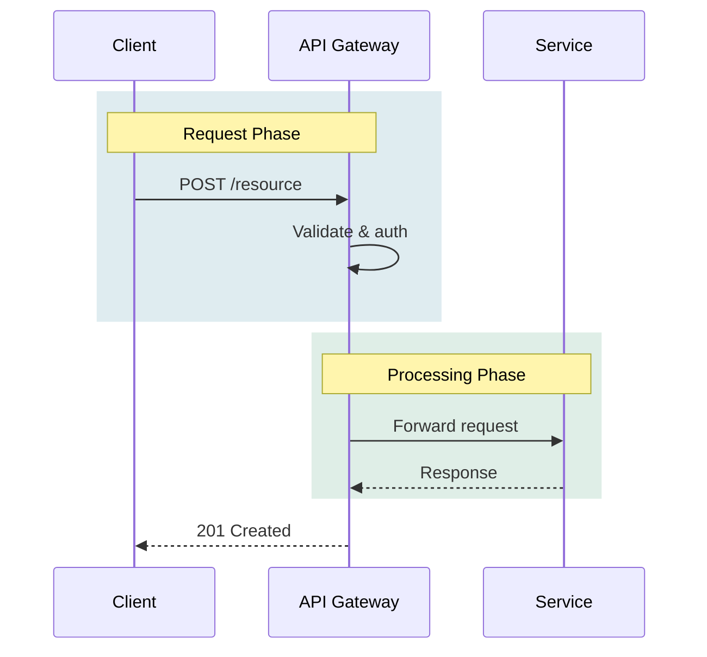

# Documentation Way

We write documentation in markdown, use language-appropriate docstrings in code, and use Mermaid for diagrams. These aren't arbitrary choices — markdown renders everywhere, docstrings live with the code they describe, and Mermaid diagrams are version-controllable text that renders in GitHub, VS Code, and most documentation tooling.

## README Philosophy

**Gist first.** A reader should understand what this is and why it exists within 30 seconds.

**Scale to complexity.** Simple project = simple README. Complex project = README + docs tree.

## README Anti-Patterns

- **Monolith** - Everything in one massive file
- **Installation-first** - Burying the "what" under "how to install"
- **No context** - Assuming reader knows what problem this solves
- **Over-documenting simple things** - 500 lines for a utility script

## README Structure

```markdown
# Project Name

One sentence: what it is.

One paragraph: why it exists, what problem it solves.

## Quick Start (if applicable)
Minimal steps to see it work.

## [More sections as needed]
Keep README focused. Link to docs/ for depth.
```

## When to Use docs/

| Complexity | Documentation |
|------------|---------------|
| Script/utility | README only |
| Small library | README + examples |
| Application | README + docs/ tree |
| Platform | README + docs/ + guides + API docs |

## docs/ Structure (when needed)

```
docs/
├── getting-started.md
├── configuration.md
├── guides/
│   └── specific-workflows.md
└── reference/
    └── api.md
```

## Docstrings

We use docstrings in every language, following the idiomatic style for that language:

| Language | Style | Example |
|----------|-------|---------|
| Python | Google-style docstrings | `"""Summary.\n\nArgs:\n    param: Description.\n"""` |
| JavaScript/TypeScript | JSDoc | `/** @param {string} name - Description */` |
| Rust | Doc comments | `/// Summary of the function.` |
| Go | Godoc | `// FunctionName does X.` |
| Shell/Bash | Header comment block | `# Description of what this script does` |

**When to write docstrings:**
- Public APIs, exported functions, classes, modules — always
- Complex internal logic where intent isn't obvious from the name
- Not needed for trivial getters, one-line helpers, or self-evident code

## Diagrams — Mermaid, Not ASCII

In docs files, we use Mermaid diagrams instead of ASCII art. Mermaid is diffable, renderable, and doesn't break when you need to add a box in the middle.

**Choose the right diagram type for the content:**

| Content | Diagram Type | Not |
|---------|-------------|-----|
| Temporal sequences, request/response flows | `sequenceDiagram` | flowchart |
| State transitions, lifecycles | `stateDiagram-v2` | flowchart |
| Decision logic, branching paths | `flowchart` | sequence |
| Class/entity relationships | `classDiagram` | flowchart |
| Timelines, project phases | `gantt` or `timeline` | flowchart |
| Git branching strategies | `gitgraph` | flowchart |

The most common mistake is using flowchart for everything. If the content has a time axis, it's a sequence diagram. If things transition between states, it's a state diagram.

## Mermaid GitHub Compatibility

**Line breaks in node labels:** GitHub's Mermaid renderer does not support `\n` for line breaks — it renders the literal text `\n`. Use `<br>` or `<br/>` inside quoted strings instead:

```mermaid
%% Wrong — GitHub renders literal \n
flowchart LR
    A["First line\nSecond line"]

%% Correct — GitHub renders a line break
flowchart LR
    A["First line<br>Second line"]
```

When reviewing or writing Mermaid diagrams, replace any `\n` in node labels with `<br>`.

## Mermaid Styling

We want diagrams that are legible in both dark and light mode contexts, with good color saturation to help readers differentiate processes and concerns.

**Color principles:**
- Use **mid-saturation colors** — vivid enough to differentiate, not so bright they strain
- Avoid pure white (`#fff`) or pure black (`#000`) fills — they break in one mode or the other
- Use **consistent text colors** that contrast against their fill in both modes

**Recommended palette for fills and styling:**

```
Concern separation colors (good contrast, mid-saturation):
  #2D7D9A  — teal/process blue
  #7B2D8E  — purple/integration
  #2D8E5E  — green/success/data
  #C2572A  — burnt orange/warning/external
  #5A6ABF  — slate blue/internal
  #8E6B2D  — amber/config/state

Text on colored fills:
  #FFFFFF  — white text on darker fills above
  #1A1A2E  — dark text on lighter fills if needed

Borders:
  #4A5568  — neutral gray, works both modes
```

**Example with styling:**



**Avoid:**
- Default unstyled diagrams when 3+ actors or concerns are present — add color to help the reader
- Neon or pastel fills that disappear against white or dark backgrounds
- Text-on-fill combinations that require squinting

## Principles

- **Progressive disclosure** - Overview → Details → Deep dives
- **Task-oriented** - Organize by what people want to do
- **Keep README current** - Outdated README = broken front door
